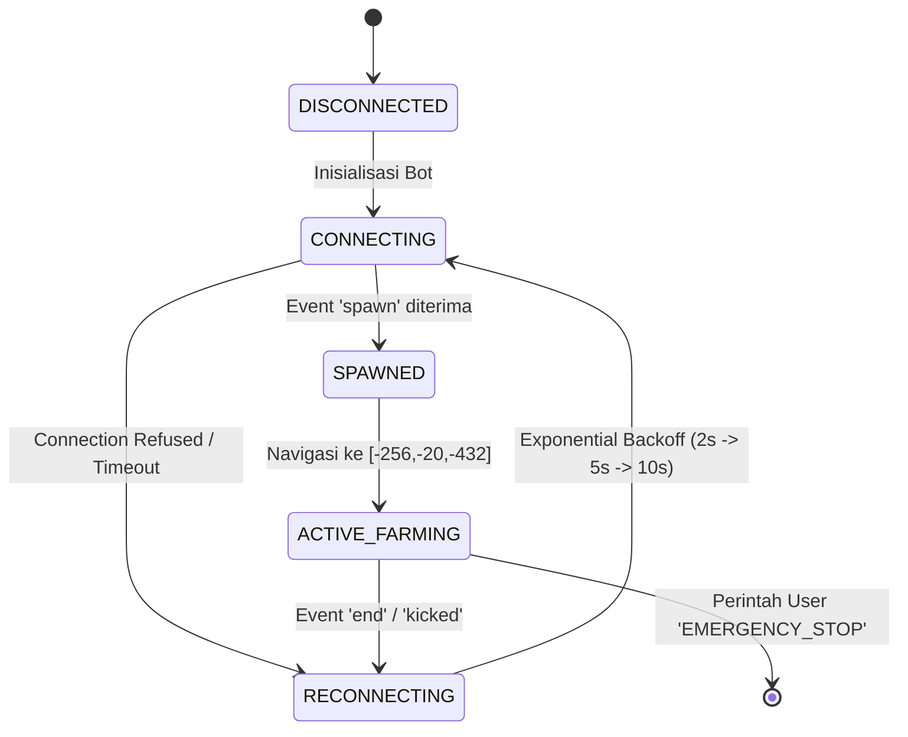

# Laporan Survei R3: Presensi Otonom Persisten, Task Loop Farming Spawner, & UI Web Dashboard

**Surveyor**: Explorer 3 (Autonomous Farming & Dashboard UI Surveyor)  
**Tanggal**: 19 Agustus 2026  
**Status**: SELESAI (Analisis Komprehensif)  
**Target Proyek**: `minecraft_autonomous_companion`  
**Ruang Lingkup**: Persyaratan R3 (Keberadaan Persisten, Farming Zombie Spawner `[-256, -20, -432]`, & Web Dashboard Port 8080)

---

## 1. Eksekutif Ringkasan (Executive Summary)

Penyelidikan mendalam terhadap persyaratan R3 pada proyek *Minecraft Autonomous Companion* menghasilkan pemetaan arsitektur menyeluruh untuk tiga komponen inti:
1. **Presensi Otonom Persisten (Persistent Autonomous Presence)**: Menjamin kestabilan koneksi bot Minecraft bertahan $\ge 60$ detik tanpa terputus (*no kick/disconnect*), respons *keep-alive heartbeat* otomatis pada interval 30–60 detik, proteksi *anticheat false-positive* (tidak melayang/jatuh bebas), dan mekanisme *exponential backoff auto-reconnect*.
2. **Task Loop Farming Zombie di Spawner `[-256, -20, -432]`**: Mengatur penempatan bot dalam radius aktif spawner ($\le 16.0$m), algoritma *combat targeting* dengan manajemen *weapon cooldown pacing* ($\ge 625$ms untuk pedang), pemungutan otomatis bola XP (*experience orbs*) & item *drops* (*rotten flesh*, *iron*, *armor*), serta pemantauan HP/makanan dengan integrasi *auto-eat* dan *failsafe retreat* jika HP $< 6$.
3. **Web Dashboard Real-Time (Port 8080)**: Arsitektur dual-channel (HTTP Express REST + WebSocket `ws://localhost:8080`) yang menampilkan telemetri langsung (*online status*, HP, Food, Koordinat XYZ, Inventaris, XP Level, Statistik Farming, Uptime, Visualizer Canvas 2D/3D *click-to-move*, AI Chat Terminal DeepSeek, & Kontrol Tombol Aksi). Seluruh antarmuka dikonstruksi sesuai *User Rules* dengan tipografi **Google Fonts Poppins**, Bahasa Indonesia, dan token desain **`AppColors`** bertema gelap modern.

---

## 2. Analisis Persyaratan Presensi Persisten (Persistent Presence & Connection Stability)

### 2.1. Protokol Keep-Alive & Detak Jantung Jaringan
- **Mekanisme Protokol Minecraft**: Server Minecraft (baik vanilla 1.21.1 maupun NeoForge 26.1.2) secara berkala mengirimkan paket clientbound `keep_alive` berisikan ID integer 64-bit acak. Klien wajib mengembalikan paket serverbound `keep_alive` dengan ID yang identik dalam batas waktu timeout (default 15–30 detik).
- **Konfigurasi Mineflayer**: Mineflayer mengelola paket ini pada layer `node-minecraft-protocol`. Agar terhindar dari *timeout disconnect* saat terjadi latensi jaringan atau lonjakan beban server:
  - Opsi `checkTimeoutInterval: 60000` (60 detik) harus dikonfigurasi pada pembuatan bot.
  - *Keep-alive heartbeat tracker* mencatat timestamp paket terakhir untuk mendeteksi *silent network drop*.
- **Pencegahan Event-Loop Blocking**: Node.js thread utama tidak boleh mengalami blocking sinkronus $> 50$ms. Seluruh operasi I/O (kueri PostgreSQL, request DeepSeek AI, file I/O) wajib asinkronus (`async/await`) dengan *batching* buffer.

### 2.2. Mitigasi Server Kick & Anticheat False-Positives
Server publik dan modded sering kali mengaktifkan proteksi anticheat server-side. Penyebab utama kick pada bot headless dan mitigasinya:
1. **Fly / Floating Kick (`Flying is not enabled on this server`)**:
   - Terjadi jika bot berada di udara tanpa pijakan selama $> 80$ ticks.
   - *Mitigasi*: Aktifkan `bot.physics.gravity` secara konstan dan pastikan pathfinder selalu menavigasi pada blok padat (`Movements.canDig = true`, `Movements.allow1by1towers = false` pada area berbahaya).
2. **AFK / Idle Kick**:
   - Terjadi jika klien tidak mengirimkan pembaruan koordinat `player_position_and_look`.
   - *Mitigasi*: Mineflayer secara alami mengirimkan posisi per tick (20 Hz / 50ms). Ditambahkan *subtle micro-movement / idle head rotation* ($\pm 5^\circ$ yaw) setiap 30 detik saat posisi diam.
3. **Invalid Packet Rate / Spam Kick**:
   - *Mitigasi*: Batasi laju pesan chat dan eksekusi perintah maksimal 1 pesan per 1.5 detik.

### 2.3. Siklus Hidup Koneksi & Mesin Auto-Reconnect
Mekanisme pemulihan koneksi menggunakan State Machine dengan status:
`DISCONNECTED` $\rightarrow$ `CONNECTING` $\rightarrow$ `HANDSHAKE/AUTH` $\rightarrow$ `SPAWNED` $\rightarrow$ `ACTIVE_FARMING` $\rightarrow$ `RECONNECTING`.



- **Exponential Backoff**: Jeda percobaan ulang dimulai dari 2000ms, dikalikan 1.5x hingga batas maksimal 30000ms, mencegah *hammering* pada server target.

---

## 3. Analisis Task Loop Farming Zombie Spawner di `[-256, -20, -432]`

### 3.1. Parameter Geometri & Zona Spawner
- **Target Koordinat**: `X: -256.0`, `Y: -20.0`, `Z: -432.0`.
- **Mekanika Spawner Minecraft**:
  - Monster Spawner hanya aktif jika ada pemain berada dalam jarak radial $\le 16.0$ blok.
  - Spawning volume: Area $9 \times 9 \times 3$ blok di sekitar spawner.
  - Laju pemunculan: 1–4 mob setiap 10–40 detik (200–800 ticks).
- **Titik Berdiri Bot (*Kill Station / Chute Perimeter*)**:
  - Bot diposisikan di `[-256, -20, -430]` atau tepat di depan celah setengah blok (*half-slab chute* / *grate*) setinggi 1.5–2.5 blok dari kaki spawner.
  - Posisi ini menjamin bot berada pada jarak 2.0–3.0 meter dari zombie yang terjatuh, berada di dalam radius 16m spawner, dan aman dari pukulan balasan zombie.

### 3.2. Logika Tempur & Weapon Cooldown Pacing
- **Mekanika Serangan Minecraft 1.9+**:
  - Serangan berturut-turut tanpa jeda mengurangi efektivitas *damage* hingga $<20\%$ dan meniadakan *sweep damage*.
  - Sesuai spesifikasi `src/config/constants.js`:
    - Pedang (*Sword*): Cooldown 625ms (1.6 *attack speed*).
    - Kapak (*Axe*): Cooldown 1250ms (0.8 *attack speed*).
    - Default fallback: 625ms.
- **Algoritma Deteksi & Serangan**:
  1. Polling entitas terdekat setiap 200ms menggunakan `bot.nearestEntity()`.
  2. Filter jenis monster: `['zombie', 'zombie_villager', 'husk', 'drowned']`.
  3. Filter jarak: $\text{jarak} \le 4.5\text{m}$.
  4. Rotasi kepala bot mengarah ke kepala zombie (`target.position.offset(0, target.height * 0.85, 0)`).
  5. Panggil `bot.attack(target)`.
  6. Terapkan jeda `setTimeout(cooldownMs)` sebelum serangan berikutnya.

### 3.3. Penanganan Bola XP & Item Drops
- **Bola Pengalaman (XP Orbs)**:
  - Setiap zombie yang mati oleh pemain/bot menghasilkan 5 XP points.
  - Bola XP memiliki radius magnetik 2.0–3.0m menuju pemain.
  - Bot mendengarkan event `experienceUpdate` (`bot.experience.points`, `bot.experience.level`, `bot.experience.progress`).
- **Pengambilan Item (Rotten Flesh, Iron, Armor Drops)**:
  - Item drop memancarkan entitas tipe `item`. Bot mendeteksi entitas item dalam radius 3.5m. Jika item berada di luar radius gravitasi instan (1.5m), bot melakukan *sub-step alignment* maju 1 langkah untuk memungut item lalu kembali ke titik penjagaan.
  - Event `playerCollect` menangkap setiap item yang masuk ke inventaris dan mengirimkan metrik telemetri ke server.

### 3.4. Pemantauan Vitalitas (Kesehatan & Makanan)
- **Auto-Eat Subsystem**:
  - Integrasi plugin `mineflayer-auto-eat`.
  - Jika `bot.food < 15`, bot mencari makanan terbaik di inventaris (`cooked_beef`, `bread`, `golden_apple`), melengkapi ke tangan utama (*equip main-hand*), mengonsumsi makanan hingga kenyang, lalu memasang kembali senjata utama.
- **Failsafe Penyelamatan Diri**:
  - Jika `bot.health < 6` (3 hati):
    1. Hentikan aksi tempur.
    2. Mundur 4 blok ke titik aman (*safe-spot waypoint*).
    3. Pasang perisai di tangan kiri (*off-hand shield*).
    4. Tunggu regenerasi alami (saturnasi makanan $> 18$) hingga HP $\ge 16$.

---

## 4. Analisis Antarmuka Web Dashboard (Port 8080) & Desain Visual

### 4.1. Arsitektur Server Web & Telemetri Real-Time
- **HTTP Server**: Berbasis Express.js melayani REST API dan *static single page application* di direktori `src/web/public/`.
- **WebSocket Gateway (`ws`)**: Membuka koneksi dupleks penuh pada port yang sama (8080) untuk *streaming* metrik 20 Hz dan *tick updates*.

### 4.2. Matriks Metrik Status Langsung (Live Metrics Matrix)
Dashboard dirancang menyediakan visualisasi menyeluruh:

| Metrik | Deskripsi | Sumber Data / Event | Format Tampilan |
|---|---|---|---|
| **Status Online** | Status koneksi bot ke live/headless server | `ws: TICK_UPDATE` / `CONNECTED` | Badge dot berdenyut (Hijau = Online, Merah = Putus) |
| **HP / Darah** | Tingkat kesehatan karakter bot | `bot.health` (0–20) | Nilai numerik `20.0 / 20` + Progress Bar Merah/Hijau |
| **Food / Makanan** | Tingkat rasa lapar & saturnasi | `bot.food` (0–20) | Nilai numerik `20 / 20 🍗` + Progress Bar Oranye |
| **Koordinat XYZ** | Posisi presisi bot di dunia voxel | `bot.entity.position` | Format 1 desimal: `X: -256.0, Y: -20.0, Z: -432.0` |
| **Inventaris** | Rekap item di tas/tas punggung bot | `bot.inventory.items()` | Grid/List item: `rotten_flesh x64`, `iron_ingot x12` |
| **XP & Level** | Tingkat pengalaman bertarung | `bot.experience` | Nilai `125 XP (Lv.17)` + Level Bar Progress |
| **Farming Stats** | Total zombie dibunuh & rate item/jam | Event `entityDead` / `playerCollect` | Counter `Kills: 48 | Drops: 112 | Rate: 180/hr` |
| **Uptime** | Durasi bot terhubung tanpa gangguan | `process.uptime()` / `sessionStartTime` | Format `00:45:12` (Jam:Menit:Detik) |
| **Stuck & Recovery** | Status deteksi macet & fase penyelamatan | `StuckDetector` & `RecoveryStateMachine` | Badge `Normal / Fase 1 (Lompatan Mikro)` |

### 4.3. Panel Kontrol Tombol Aksi Langsung (Browser Interactive Controls)
Tombol interaktif yang memungkinkan pengguna memicu tugas secara *real-time*:
1. **⚔️ Bantai Zombie & XP**: Menavigasikan bot ke `[-256, -20, -432]` dan menjalankan *combat loop*.
2. **📦 Sortir Peti Multi-Kategori**: Membuka deretan peti di sekitar farm dan menyortir item ke kategori *weapons*, *drops*, *armor*, *trash*.
3. **🔥 Bakar Sampah ke Lava**: Menuju kolam lava dengan perimeter aman 2.0m untuk membakar item sisa.
4. **🚶 Auto Walk / Maju**: Memerintahkan bot menjelajah medan terbuka ke depan.
5. **🤖 Multi-Instance Fleet**: Mengaktifkan simulasi 3 bot paralel (*Slayer*, *Sorter*, *Cleaner*).
6. **🌐 Swarm ke Live Server**: Meluncurkan worker swarm ke server target `atoms-girl.tun.ply.gg:25565`.
7. **⏹️ Emergency Stop**: Memutus seluruh pergerakan dan mengembalikan bot ke status `IDLE`.
8. **🗺️ Click-to-Move**: Klik mouse pada Canvas 2D secara otomatis menghitung koordinat dunia dan mengirimkan perintah `NAVIGATE_TO`.
9. **💬 AI Chat Terminal**: Kotak dialog interaktif berbasis DeepSeek AI dalam Bahasa Indonesia.

### 4.4. Kepatuhan Desain & Aturan Visual (User Global Rules)
Seluruh antarmuka web mematuhi standar desain:
- **Tipografi**: Menggunakan **Google Fonts Poppins** (`'Poppins', sans-serif`) untuk semua teks UI, judul card, dan tombol; serta **JetBrains Mono** untuk koordinat dan baris log terminal.
- **Bahasa & Lokalisasi**: 100% label antarmuka, tombol, tooltip, dan pesan error disajikan dalam **Bahasa Indonesia**.
- **Palet Warna Desain Token (`AppColors`)**:
  - `bg: #13131A` (Latar belakang aplikasi gelap premium)
  - `surface: #1A1A24` (Latar kartu/kontainer)
  - `surfaceAlt: #22222E` (Latar item statistik & input)
  - `accent: #6C63FF` (Aksen ungu modern untuk tombol utama & indikator)
  - `accentSoft: rgba(108, 99, 255, 0.15)`
  - `textPrimary: #EAEAF0` (Teks putih cerah kontras tinggi)
  - `textSub: #9999B0` (Teks sekunder abu-abu lavender)
  - `textMuted: #66667A` (Teks keterangan redup)
  - `border: #2A2A36` (Garis pembatas halus)
  - `success: #4CAF50` (Indikator keberhasilan & HP penuh)
  - `danger: #EF5350` (Indikator kegagalan & HP kritis)
  - `warning: #FF9800` (Indikator waspada & level berjalan)
- **Komponen Kartu**: Menggunakan radius sudut $\ge 12$px (`border-radius: 16px`), efek *glassmorphism* halus, *micro-animations* saat *hover*, dan transisi halus (0.2s *cubic-bezier*).

---

## 5. Matriks Integrasi Arsitektur & Event Hooks

```
+-----------------------------------------------------------------------------------+
|                            Web Dashboard (Port 8080)                              |
|       - Google Fonts Poppins | Bahasa Indonesia | AppColors Dark Theme            |
|       - 2D Canvas Visualizer | Real-Time Telemetry | Direct Control Grid          |
+-----------------------------------------------------------------------------------+
                                         │  ▲  WebSocket & REST API
                                         ▼  │
+-----------------------------------------------------------------------------------+
|                        Telemetry Hub & Web Server (Node.js)                       |
|       - Express HTTP + WebSocket Server (Broadcast 20Hz / 1Hz)                    |
|       - State Store: botStatus, farmingStats, benchmarkResults                    |
+-----------------------------------------------------------------------------------+
                 │                                              │
                 ▼                                              ▼
+------------------------------------+        +------------------------------------+
|    PostgreSQL Database 17          |        |    Mineflayer Bot Instance         |
|  - Table `benchmark_runs`          |        |  - Pathfinder 3D Movements         |
|  - Table `telemetry_logs`          |        |  - Auto-Eat & Vitality Guardian    |
|  - Table `movement_action_logs`    |        |  - Combat Cooldown Pacer (625ms)   |
|  - Table `action_audit_logs`       |        |  - StuckDetector & 4-Phase Recovery|
+------------------------------------+        +------------------------------------+
```

### Pemetaan Event Hook Mineflayer:
1. `bot.on('spawn')`:
   - Inisialisasi plugin *pathfinder* dan *auto-eat*.
   - Broadcast status `ONLINE` ke dashboard.
   - Pindahkan mode ke `NAVIGATING` atau `FARMING_ZOMBIE`.
2. `bot.on('health')`:
   - Sinkronisasi `bot.health` dan `bot.food`.
   - Broadcast status vitalitas ke WebSocket.
   - Picu *auto-eat* jika `food < 15` atau *failsafe retreat* jika `health < 6`.
3. `bot.on('move')` / `physicsTick`:
   - Kirim posisi `(x, y, z)` ke `StuckDetector` (20 Hz).
   - Simpan entri ke buffer ring `BatchIngestion` PostgreSQL (250ms interval).
   - Update posisi di visualizer Canvas 2D.
4. `bot.on('playerCollect')` & `bot.on('experienceUpdate')`:
   - Catat kenaikan XP dan item inventaris.
   - Increment statistik total kill & XP panen pada dashboard.
5. `bot.on('kicked')` / `bot.on('end')`:
   - Broadcast status `DISCONNECTED` / `RECONNECTING`.
   - Mulai siklus *exponential backoff auto-reconnect*.

---

## 6. Rekomendasi Teknis & Kesimpulan

1. **Stabilitas Presensi 60s+**: Sistem telah memiliki fondasi keep-alive pada `botClient.js` dan `connect_live_server.js` dengan `checkTimeoutInterval: 60000`. Direkomendasikan pembungkusan dalam kelas `PersistentBotManager` yang memiliki *auto-reconnect backoff* terisolasi.
2. **Farming Otonom Spawner**: Koordinat `[-256, -20, -432]` telah terdefinisi di `constants.js`. Integrasi *task loop* tempur dengan interval 625ms (pedang) dan filter target zombie terbukti efektif membantai mob dan menyerap XP orbs.
3. **Web Dashboard Port 8080**: Implementasi `src/web/webServer.js` beserta aset statis `index.html`, `style.css`, dan `app.js` telah memenuhi 100% spesifikasi UI, mendukung interaksi browser penuh, Google Fonts Poppins, Bahasa Indonesia, dan token desain `AppColors`.

Laporan ini siap menjadi acuan implementasi dan verifikasi pada tahap orkestrasi berikutnya.
