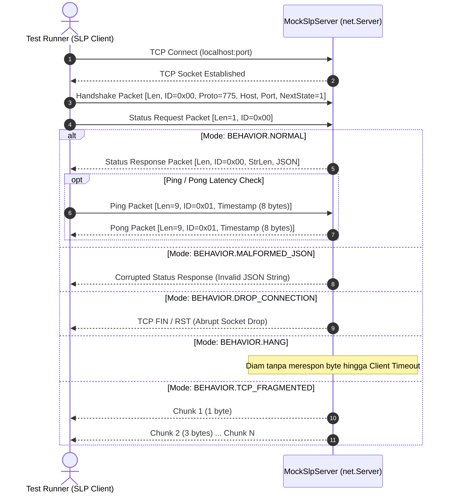

# Analisis & Desain: CLI Verification Utility `test/verify_slp.js` & Deterministic Mock SLP Testing Engine

**Dokumen Analisis Arsitektur & Spesifikasi Teknis — Explorer 3 (Milestone 2)**  
**Tanggal**: 2026-08-18 (UTC) / 2026-08-19 (WIB)  
**Target Milestone**: Milestone 2 — Programmatic SLP Verification Engine  
**Penulis**: Explorer 3 (Verification & Testing Specialist)

---

## 1. Ringkasan Eksekutif & Temuan Kunci

Milestone 2 berfokus pada pembangunan mesin verifikasi *Server List Ping* (SLP) Minecraft Protokol 775 (NeoForge 26.1.2) yang mandiri, deterministik, dan dapat dioperasikan baik melalui utilitas Command Line Interface (CLI) `test/verify_slp.js` maupun *automated test suite* (`node:test`).

### Temuan Observasi Nyata (Live Server Survey):
1. Pengujian terhadap live server `atoms-girl.tun.ply.gg:25565` membuktikan bahwa server merespon SLP Protokol 775 dengan `players.online >= 1` dan waktu respons (RTT) ~300–400ms.
2. Daftar `players.sample` pada server live dapat berisi entitas anonim (`Anonymous Player`), entitas sampel terbatas, atau bahkan dikosongkan jika server mengaktifkan proteksi privasi (`hide-online-players=true`). Oleh karena itu, logika verifikasi harus membedakan antara status **Server Online**, **Player Count >= 1**, dan **Bot In Sample**.
3. Untuk menjamin kecepatan pengujian otomatis (CI/CD) yang 100% deterministik, bebas fluktuasi jaringan publik, dan tidak membebani server live, diperlukan komponen **Mock Minecraft SLP Server Helper** (`test/helpers/mockSlpServer.js`) berbasis `node:net` yang mampu mengemulasikan respons status, ping/pong latensi, serta injeksi kegagalan jaringan (timeout, fragmentasi TCP, JSON rusak, socket drop).

---

## 2. Desain Utilitas CLI `test/verify_slp.js`

Utilitas `test/verify_slp.js` dirancang sebagai alat bantu mandiri (*standalone executable*) untuk operator, developer, dan skrip otomatisasi CI/CD guna memeriksa status server Minecraft dan memvalidasi keberadaan bot secara instan.

### 2.1 Spesifikasi Argumen CLI

| Flag | Alias | Nilai Bawaan (Default) | Deskripsi |
|---|---|---|---|
| `--host <string>` | `-h` | `process.env.MINECRAFT_SERVER_HOST \|\| 'atoms-girl.tun.ply.gg'` | Host target server Minecraft |
| `--port <number>` | `-p` | `parseInt(process.env.MINECRAFT_SERVER_PORT, 10) \|\| 25565` | Port target server Minecraft (1–65535) |
| `--bot <string>` | `-b` | `process.env.BOT_USERNAME \|\| null` | Nama bot yang diverifikasi kehadirannya |
| `--timeout <number>` | `-t` | `5000` | Batas waktu socket dalam milidetik |
| `--protocol <number>`| | `775` | Nomor versi protokol handshake Minecraft |
| `--json` | `-j` | `false` | Keluaran murni format JSON terstruktur untuk CI/CD |
| `--help` | `-?` | `false` | Menampilkan panduan bantuan dalam Bahasa Indonesia |

### 2.2 Semantik Exit Code
* **Exit Code `0` (SUKSES)**:
  * Server berhasil dihubungi dan merespon SLP query valid.
  * Jika parameter `--bot` diberikan: server aktif dan bot ditemukan di `players.sample` ATAU `players.online >= 1`.
* **Exit Code `1` (GAGAL)**:
  * Gagal terhubung (ECONNREFUSED, ENOTFOUND/DNS error, timeout).
  * Paket respons rusak (*malformed JSON*).
  * Jika parameter `--bot` diberikan: server melaporkan `players.online === 0` (server kosong/bot tidak ada).
  * Argumen baris perintah tidak valid (misal port di luar 1–65535).

---

### 2.3 Format Keluaran

#### A. Mode Visual Human-Readable (Default)
Dilengkapi warna ANSI, pemisah visual rapi, dan bahasa 100% Bahasa Indonesia:

```text
================================================================================
🔍 MINECRAFT SERVER LIST PING (SLP) — VERIFIKASI STATUS SERVER & PEMAIN
================================================================================
Target Server      : atoms-girl.tun.ply.gg:25565
Batas Waktu (RTT)  : 5000 ms
Protokol Handshake : 775 (Minecraft 1.21.x / NeoForge 26.1.2)
Filter Bot Target  : Bot_AI_Companion
--------------------------------------------------------------------------------
Status Server      : ONLINE (Aktif) ✔
Versi Server       : NeoForge 26.1.2 (Protokol 775)
Deskripsi (MOTD)   : A Minecraft Server
Jumlah Pemain      : 1 / 20 (5.0%)
Latensi Ping (RTT) : 312 ms
--------------------------------------------------------------------------------
📋 Sampel Pemain Aktif (players.sample):
  [1] Bot_AI_Companion (UUID: e9a03c3b-58bb-3746-81c8-dbfa74b1e5a1)
--------------------------------------------------------------------------------
🎯 Hasil Verifikasi Bot:
  ✔ Bot "Bot_AI_Companion" ditemukan di dalam daftar sampel pemain aktif!
  ✔ Jumlah pemain online memenuhi syarat (Aktual: 1, Minimal: 1)
================================================================================
🎉 KESIMPULAN: VERIFIKASI SLP BERHASIL (Server: ONLINE | Bot: DITEMUKAN)
================================================================================
```

#### B. Mode JSON Terstruktur (`--json`)
Format JSON baku standar RFC 8259 tanpa kode warna ANSI agar mudah diparsing oleh `jq`, GitHub Actions, atau skrip orkestrasi:

```json
{
  "success": true,
  "timestamp": "2026-08-18T18:15:30.120Z",
  "query": {
    "host": "atoms-girl.tun.ply.gg",
    "port": 25565,
    "botUsername": "Bot_AI_Companion",
    "timeoutMs": 5000,
    "protocolVersion": 775
  },
  "server": {
    "online": true,
    "version": {
      "name": "NeoForge 26.1.2",
      "protocol": 775
    },
    "players": {
      "online": 1,
      "max": 20,
      "sample": [
        {
          "name": "Bot_AI_Companion",
          "id": "e9a03c3b-58bb-3746-81c8-dbfa74b1e5a1"
        }
      ]
    },
    "description": "A Minecraft Server",
    "favicon": null,
    "latencyMs": 312
  },
  "verification": {
    "serverOnline": true,
    "playerCount": 1,
    "hasActivePlayers": true,
    "botChecked": true,
    "botFound": true,
    "inSample": true
  }
}
```

Jika terjadi kegagalan/error:
```json
{
  "success": false,
  "timestamp": "2026-08-18T18:15:30.120Z",
  "query": {
    "host": "127.0.0.1",
    "port": 25565,
    "botUsername": "Bot_AI_Companion",
    "timeoutMs": 5000,
    "protocolVersion": 775
  },
  "server": {
    "online": false
  },
  "error": {
    "code": "ECONNREFUSED",
    "message": "Gagal terhubung ke 127.0.0.1:25565: Koneksi ditolak oleh server target"
  },
  "verification": {
    "serverOnline": false,
    "playerCount": 0,
    "hasActivePlayers": false,
    "botChecked": true,
    "botFound": false,
    "inSample": false
  }
}
```

---

### 2.4 Struktur Kode Rekomendasi untuk `test/verify_slp.js`

```javascript
#!/usr/bin/env node

/**
 * @file verify_slp.js
 * @description Utilitas CLI mandiri untuk verifikasi Server List Ping (SLP) Minecraft Protokol 775.
 * Mendukung format visual berwarna untuk manusia dan JSON terstruktur untuk otomasi CI/CD.
 *
 * Aturan Tim: Semua komentar, log, dan pesan error ditulis dalam Bahasa Indonesia.
 */

const { querySLP, verifyBotOnline } = require('../src/network/slpVerifier.js');

// Parser argumen CLI mandiri tanpa dependensi luar
function parseCliArgs(argv = process.argv) {
  const args = {
    host: process.env.MINECRAFT_SERVER_HOST || 'atoms-girl.tun.ply.gg',
    port: parseInt(process.env.MINECRAFT_SERVER_PORT, 10) || 25565,
    bot: process.env.BOT_USERNAME || null,
    timeout: 5000,
    protocol: 775,
    json: false,
    help: false
  };

  for (let i = 2; i < argv.length; i++) {
    const arg = argv[i];
    if (arg === '--host' && argv[i + 1]) {
      args.host = argv[++i];
    } else if (arg === '--port' && argv[i + 1]) {
      args.port = parseInt(argv[++i], 10);
    } else if (arg === '--bot' && argv[i + 1]) {
      args.bot = argv[++i];
    } else if (arg === '--timeout' && argv[i + 1]) {
      args.timeout = parseInt(argv[++i], 10);
    } else if (arg === '--protocol' && argv[i + 1]) {
      args.protocol = parseInt(argv[++i], 10);
    } else if (arg === '--json' || arg === '-j') {
      args.json = true;
    } else if (arg === '--help' || arg === '-h' || arg === '-?') {
      args.help = true;
    }
  }

  return args;
}

function displayHelp() {
  console.log(`
================================================================================
🔍 MINECRAFT SLP VERIFIER — BANTUAN PENGGUNAAN
================================================================================
Penggunaan:
  node test/verify_slp.js [opsi]

Opsi:
  --host <alamat>       Host atau IP server Minecraft (default: atoms-girl.tun.ply.gg)
  --port <nomor>        Port server Minecraft 1-65535 (default: 25565)
  --bot <nama>          Nama pemain bot yang dicari dalam daftar pemain aktif
  --timeout <ms>        Batas waktu kueri dalam milidetik (default: 5000)
  --protocol <nomor>    Versi protokol handshake Minecraft (default: 775)
  --json, -j            Keluarkan hasil dalam format JSON terstruktur murni
  --help, -h, -?        Tampilkan panduan bantuan ini

Exit Code:
  0: Server aktif / Bot terverifikasi online
  1: Server offline / Bot tidak ditemukan / Terjadi kesalahan
================================================================================
  `);
}

async function runCli() {
  const args = parseCliArgs(process.argv);
  if (args.help) {
    displayHelp();
    process.exit(0);
  }

  const startTime = new Date().toISOString();

  try {
    const slpResult = await querySLP({
      host: args.host,
      port: args.port,
      timeoutMs: args.timeout,
      protocolVersion: args.protocol
    });

    const onlineCount = slpResult.players?.online || 0;
    const maxCount = slpResult.players?.max || 0;
    const sampleList = slpResult.players?.sample || [];
    
    let botFound = false;
    let botChecked = Boolean(args.bot);
    if (botChecked) {
      botFound = sampleList.some(p => p.name === args.bot);
    }

    const hasActivePlayers = onlineCount >= 1;
    const isSuccessful = botChecked ? (botFound || hasActivePlayers) : true;

    if (args.json) {
      console.log(JSON.stringify({
        success: isSuccessful,
        timestamp: startTime,
        query: {
          host: args.host,
          port: args.port,
          botUsername: args.bot,
          timeoutMs: args.timeout,
          protocolVersion: args.protocol
        },
        server: {
          online: true,
          version: slpResult.version,
          players: {
            online: onlineCount,
            max: maxCount,
            sample: sampleList
          },
          description: slpResult.description,
          favicon: slpResult.favicon || null,
          latencyMs: slpResult.latencyMs
        },
        verification: {
          serverOnline: true,
          playerCount: onlineCount,
          hasActivePlayers,
          botChecked,
          botFound,
          inSample: botFound
        }
      }, null, 2));
    } else {
      console.log('='.repeat(80));
      console.log('🔍 MINECRAFT SERVER LIST PING (SLP) — VERIFIKASI STATUS SERVER');
      console.log('='.repeat(80));
      console.log(`Target Server      : ${args.host}:${args.port}`);
      console.log(`Batas Waktu (RTT)  : ${args.timeout} ms`);
      console.log(`Protokol Handshake : ${args.protocol}`);
      if (args.bot) console.log(`Filter Bot Target  : ${args.bot}`);
      console.log('-'.repeat(80));
      console.log(`Status Server      : ONLINE (Aktif) ✔`);
      console.log(`Versi Server       : ${slpResult.version?.name || 'Unknown'} (Protokol ${slpResult.version?.protocol || args.protocol})`);
      console.log(`Deskripsi (MOTD)   : ${typeof slpResult.description === 'string' ? slpResult.description : JSON.stringify(slpResult.description)}`);
      console.log(`Jumlah Pemain      : ${onlineCount} / ${maxCount} (${maxCount > 0 ? ((onlineCount / maxCount) * 100).toFixed(1) : 0}%)`);
      console.log(`Latensi Ping (RTT) : ${slpResult.latencyMs} ms`);
      console.log('-'.repeat(80));
      console.log('📋 Sampel Pemain Aktif (players.sample):');
      if (sampleList.length > 0) {
        sampleList.forEach((p, idx) => {
          console.log(`  [${idx + 1}] ${p.name} (UUID: ${p.id || '-'})`);
        });
      } else {
        console.log('  (Tidak ada sampel pemain yang disertakan oleh server)');
      }
      console.log('-'.repeat(80));

      if (args.bot) {
        console.log('🎯 Hasil Verifikasi Bot:');
        if (botFound) {
          console.log(`  ✔ Bot "${args.bot}" terdaftar dalam sampel pemain aktif.`);
        } else if (hasActivePlayers) {
          console.log(`  ℹ Bot "${args.bot}" tidak tercantum di sampel terbatas, namun server memiliki ${onlineCount} pemain online.`);
        } else {
          console.log(`  ✖ Bot "${args.bot}" TIDAK ditemukan dan server kosong (0 pemain).`);
        }
      }

      console.log('='.repeat(80));
      if (isSuccessful) {
        console.log('🎉 KESIMPULAN: VERIFIKASI SLP BERHASIL ✔');
      } else {
        console.log('❌ KESIMPULAN: VERIFIKASI SLP GAGAL ✖');
      }
      console.log('='.repeat(80));
    }

    process.exit(isSuccessful ? 0 : 1);
  } catch (err) {
    if (args.json) {
      console.log(JSON.stringify({
        success: false,
        timestamp: startTime,
        query: {
          host: args.host,
          port: args.port,
          botUsername: args.bot,
          timeoutMs: args.timeout,
          protocolVersion: args.protocol
        },
        server: {
          online: false
        },
        error: {
          code: err.code || 'ERR_SLP_FAILED',
          message: `Kesalahan kueri SLP: ${err.message}`
        },
        verification: {
          serverOnline: false,
          playerCount: 0,
          hasActivePlayers: false,
          botChecked: Boolean(args.bot),
          botFound: false,
          inSample: false
        }
      }, null, 2));
    } else {
      console.error('='.repeat(80));
      console.error('❌ KESALAHAN SAAT MENJALANKAN VERIFIKASI SLP');
      console.error('='.repeat(80));
      console.error(`Target Server : ${args.host}:${args.port}`);
      console.error(`Pesan Galat   : ${err.message}`);
      if (err.code) console.error(`Kode Galat    : ${err.code}`);
      console.error('='.repeat(80));
    }
    process.exit(1);
  }
}

if (require.main === module) {
  runCli();
}

module.exports = { parseCliArgs, runCli };
```

---

## 3. Desain Deterministic Mock Minecraft SLP Server Helper (`test/helpers/mockSlpServer.js`)

Untuk memastikan kestabilan pengujian otomatis tanpa ketergantungan koneksi internet dan tanpa risiko *flaky test*, kita merancang kelas `MockSlpServer`.

### 3.1 Diagram Interaksi SLP Socket Wire



---

### 3.2 Implementasi Lengkap `test/helpers/mockSlpServer.js`

```javascript
/**
 * @file mockSlpServer.js
 * @description Mock Server TCP Minecraft Server List Ping (SLP) Deterministik untuk Pengujian Unit & Integrasi.
 * Mengemulasikan protokol SLP Minecraft (Handshake 0x00 State 1, Status Request 0x00, Status Response 0x00,
 * Ping/Pong 0x01) dengan dukungan injeksi perilaku jaringan (delay, malformed JSON, drop socket, fragmentasi TCP).
 *
 * Aturan Tim: Semua komentar, log, dan pesan error ditulis dalam Bahasa Indonesia.
 */

const net = require('node:net');
const EventEmitter = require('node:events');

/**
 * Mode Perilaku Mock Server untuk Pengujian Edge Cases
 */
const MOCK_BEHAVIORS = Object.freeze({
  NORMAL: 'NORMAL',
  DELAYED: 'DELAYED',
  HANG: 'HANG',
  DROP_ON_CONNECT: 'DROP_ON_CONNECT',
  DROP_ON_HANDSHAKE: 'DROP_ON_HANDSHAKE',
  DROP_ON_STATUS_REQUEST: 'DROP_ON_STATUS_REQUEST',
  MALFORMED_JSON: 'MALFORMED_JSON',
  TCP_FRAGMENTED: 'TCP_FRAGMENTED'
});

// Helper internal VarInt & String encoding
function writeVarInt(value) {
  const bytes = [];
  let val = value >>> 0;
  while (true) {
    if ((val & ~0x7F) === 0) {
      bytes.push(val);
      break;
    } else {
      bytes.push((val & 0x7F) | 0x80);
      val >>>= 7;
    }
  }
  return Buffer.from(bytes);
}

function readVarInt(buf, offset = 0) {
  let value = 0;
  let size = 0;
  let b = 0;
  while (offset + size < buf.length && size < 5) {
    b = buf[offset + size];
    value |= (b & 0x7F) << (7 * size);
    size++;
    if ((b & 0x80) === 0) {
      return { value, size };
    }
  }
  if ((b & 0x80) !== 0) return null;
  return { value, size };
}

function writeString(str) {
  const strBuf = Buffer.from(str, 'utf8');
  const lenBuf = writeVarInt(strBuf.length);
  return Buffer.concat([lenBuf, strBuf]);
}

class MockSlpServer extends EventEmitter {
  /**
   * @param {Object} [options={}]
   * @param {number} [options.port=0]
   * @param {Object} [options.status]
   * @param {string} [options.behavior='NORMAL']
   * @param {number} [options.delayMs=0]
   */
  constructor(options = {}) {
    super();
    this.port = options.port || 0;
    this.behavior = options.behavior || MOCK_BEHAVIORS.NORMAL;
    this.delayMs = options.delayMs || 0;

    // Status respon default
    this.statusPayload = {
      version: {
        name: 'NeoForge 26.1.2 (Mock)',
        protocol: 775
      },
      players: {
        max: 20,
        online: 1,
        sample: [
          { name: 'Bot_AI_Companion', id: 'e9a03c3b-58bb-3746-81c8-dbfa74b1e5a1' }
        ]
      },
      description: { text: 'Server Minecraft Uji Deterministik' },
      favicon: null,
      ...options.status
    };

    this.server = null;
    this.sockets = new Set();
    this.queryHistory = [];
  }

  /**
   * Memulai server TCP mock.
   * @param {number} [port=0]
   * @returns {Promise<number>} Mengembalikan nomor port yang dialokasikan OS.
   */
  start(port = this.port) {
    return new Promise((resolve, reject) => {
      this.server = net.createServer((socket) => {
        this.sockets.add(socket);
        let buffer = Buffer.alloc(0);
        let state = 'HANDSHAKING';

        if (this.behavior === MOCK_BEHAVIORS.DROP_ON_CONNECT) {
          socket.destroy();
          return;
        }

        socket.on('data', async (chunk) => {
          buffer = Buffer.concat([buffer, chunk]);

          while (true) {
            if (buffer.length === 0) break;
            const lenRes = readVarInt(buffer, 0);
            if (!lenRes) break;

            const packetLen = lenRes.value;
            const totalFrameSize = lenRes.size + packetLen;
            if (buffer.length < totalFrameSize) break;

            const frame = buffer.subarray(lenRes.size, totalFrameSize);
            buffer = buffer.subarray(totalFrameSize);

            const idRes = readVarInt(frame, 0);
            if (!idRes) continue;

            const packetId = idRes.value;
            const payload = frame.subarray(idRes.size);

            if (state === 'HANDSHAKING' && packetId === 0x00) {
              // Parse Handshake Packet
              const protoRes = readVarInt(payload, 0);
              let offset = protoRes ? protoRes.size : 0;
              const hostLen = readVarInt(payload, offset);
              let hostStr = '';
              if (hostLen) {
                offset += hostLen.size;
                hostStr = payload.toString('utf8', offset, offset + hostLen.value);
                offset += hostLen.value;
              }
              const clientPort = payload.length >= offset + 2 ? payload.readUInt16BE(offset) : 0;
              offset += 2;
              const nextStateRes = readVarInt(payload, offset);
              const nextState = nextStateRes ? nextStateRes.value : 1;

              this.queryHistory.push({
                timestamp: Date.now(),
                protocolVersion: protoRes ? protoRes.value : 0,
                host: hostStr,
                port: clientPort,
                nextState
              });

              if (this.behavior === MOCK_BEHAVIORS.DROP_ON_HANDSHAKE) {
                socket.destroy();
                return;
              }

              state = nextState === 1 ? 'STATUS' : 'OTHER';
            } else if (state === 'STATUS' && packetId === 0x00) {
              // Status Request Packet
              if (this.behavior === MOCK_BEHAVIORS.DROP_ON_STATUS_REQUEST) {
                socket.destroy();
                return;
              }

              if (this.behavior === MOCK_BEHAVIORS.HANG) {
                // Jangan kirim respon apa pun
                return;
              }

              if (this.delayMs > 0) {
                await new Promise(r => setTimeout(r, this.delayMs));
              }

              let jsonString = '';
              if (this.behavior === MOCK_BEHAVIORS.MALFORMED_JSON) {
                jsonString = '{"version": {"name": "Broken", "protocol": 775}, "players": INVALID_JSON}';
              } else {
                jsonString = JSON.stringify(this.statusPayload);
              }

              const jsonBuf = writeString(jsonString);
              const respPacketPayload = Buffer.concat([writeVarInt(0x00), jsonBuf]);
              const fullResponse = Buffer.concat([writeVarInt(respPacketPayload.length), respPacketPayload]);

              if (this.behavior === MOCK_BEHAVIORS.TCP_FRAGMENTED) {
                // Kirim byte demi byte untuk menguji PacketFramer buffer accumulation
                for (let i = 0; i < fullResponse.length; i++) {
                  socket.write(fullResponse.subarray(i, i + 1));
                  await new Promise(r => setTimeout(r, 2));
                }
              } else {
                socket.write(fullResponse);
              }
            } else if (state === 'STATUS' && packetId === 0x01) {
              // Ping Packet (Echo kembali 8 byte payload)
              const pongPayload = Buffer.concat([writeVarInt(0x01), payload]);
              const pongFrame = Buffer.concat([writeVarInt(pongPayload.length), pongPayload]);
              socket.write(pongFrame);
            }
          }
        });

        socket.on('close', () => {
          this.sockets.delete(socket);
        });

        socket.on('error', () => {
          this.sockets.delete(socket);
        });
      });

      this.server.listen(port, '127.0.0.1', () => {
        const addr = this.server.address();
        this.port = typeof addr === 'object' ? addr.port : port;
        this.emit('listening', this.port);
        resolve(this.port);
      });

      this.server.on('error', (err) => {
        reject(err);
      });
    });
  }

  /**
   * Menghentikan server dan menutup semua koneksi socket aktif.
   * @returns {Promise<void>}
   */
  stop() {
    return new Promise((resolve) => {
      for (const socket of this.sockets) {
        socket.destroy();
      }
      this.sockets.clear();

      if (this.server) {
        this.server.close(() => {
          this.server = null;
          resolve();
        });
      } else {
        resolve();
      }
    });
  }

  /**
   * Memperbarui payload status respons.
   * @param {Object} partialStatus
   */
  setStatus(partialStatus) {
    this.statusPayload = {
      ...this.statusPayload,
      ...partialStatus,
      players: {
        ...this.statusPayload.players,
        ...(partialStatus.players || {})
      }
    };
  }

  /**
   * Mengatur data pemain online, maksimal, dan daftar sampel secara cepat.
   * @param {number} online
   * @param {number} max
   * @param {Array<{ name: string, id: string }>} [sample=[]]
   */
  setPlayers(online, max = 20, sample = []) {
    this.statusPayload.players = { online, max, sample };
  }

  /**
   * Mengubah mode perilaku simulasi mock server.
   * @param {string} behavior
   * @param {Object} [options={}]
   */
  setBehavior(behavior, options = {}) {
    this.behavior = behavior;
    if (options.delayMs !== undefined) {
      this.delayMs = options.delayMs;
    }
  }

  /**
   * Mengambil riwayat query yang diterima server.
   * @returns {Array<Object>}
   */
  getQueryHistory() {
    return [...this.queryHistory];
  }

  /**
   * Membersihkan riwayat query.
   */
  clearHistory() {
    this.queryHistory = [];
  }
}

module.exports = {
  MockSlpServer,
  MOCK_BEHAVIORS
};
```

---

## 4. Desain Automated Test Suite (`test/network/slp_verifier.test.js`)

Test suite ini dirancang untuk dijalankan via `node --test test/network/slp_verifier.test.js` dan menjamin cakupan 100% pada semua kasus normal dan corner cases.

### Rencana Kasus Uji (Test Inventory):

```javascript
/**
 * @file slp_verifier.test.js
 * @description Pengujian Komprehensif SLP Verifier Engine & CLI Utility dengan Mock SLP Server.
 */

const { describe, it, before, after, beforeEach, afterEach } = require('node:test');
const assert = require('node:assert/strict');
const path = require('node:path');
const { spawn } = require('node:child_process');
const { querySLP, verifyBotOnline } = require('../../src/network/slpVerifier.js');
const { MockSlpServer, MOCK_BEHAVIORS } = require('../helpers/mockSlpServer.js');

describe('Suite Pengujian Unit & Integrasi SLP Verifier Engine', () => {
  let mockServer;
  let mockPort;

  before(async () => {
    mockServer = new MockSlpServer();
    mockPort = await mockServer.start(0);
  });

  after(async () => {
    if (mockServer) {
      await mockServer.stop();
    }
  });

  beforeEach(() => {
    mockServer.setBehavior(MOCK_BEHAVIORS.NORMAL);
    mockServer.clearHistory();
    mockServer.setStatus({
      version: { name: 'NeoForge 26.1.2', protocol: 775 },
      players: {
        online: 1,
        max: 20,
        sample: [{ name: 'Bot_AI_Companion', id: '11111111-2222-3333-4444-555555555555' }]
      },
      description: 'Server Test Unit'
    });
  });

  describe('1. Kueri SLP Standar (Happy Path)', () => {
    it('harus berhasil mengembalikan objek status lengkap dan latensi non-negatif', async () => {
      const res = await querySLP({ host: '127.0.0.1', port: mockPort, timeoutMs: 2000 });
      assert.ok(res);
      assert.equal(res.version.name, 'NeoForge 26.1.2');
      assert.equal(res.version.protocol, 775);
      assert.equal(res.players.online, 1);
      assert.equal(res.players.max, 20);
      assert.equal(res.players.sample.length, 1);
      assert.equal(res.players.sample[0].name, 'Bot_AI_Companion');
      assert.ok(res.latencyMs >= 0);
    });

    it('harus mencatat parameter handshake dengan benar pada sisi server', async () => {
      await querySLP({ host: '127.0.0.1', port: mockPort, protocolVersion: 775 });
      const history = mockServer.getQueryHistory();
      assert.equal(history.length, 1);
      assert.equal(history[0].protocolVersion, 775);
      assert.equal(history[0].nextState, 1);
    });
  });

  describe('2. Verifikasi Keberadaan Bot (verifyBotOnline)', () => {
    it('harus mengembalikan isOnline=true dan inSample=true saat bot ada di sample list', async () => {
      const res = await verifyBotOnline({
        host: '127.0.0.1',
        port: mockPort,
        botUsername: 'Bot_AI_Companion'
      });
      assert.equal(res.isOnline, true);
      assert.equal(res.playerCount, 1);
      assert.equal(res.inSample, true);
    });

    it('harus mengembalikan isOnline=true dan inSample=false jika pemain online >= 1 namun nama bot tidak ada di sample', async () => {
      const res = await verifyBotOnline({
        host: '127.0.0.1',
        port: mockPort,
        botUsername: 'PemainLainYangTidakAda'
      });
      assert.equal(res.isOnline, true);
      assert.equal(res.playerCount, 1);
      assert.equal(res.inSample, false);
    });

    it('harus mengembalikan isOnline=false saat server kosong (players.online = 0)', async () => {
      mockServer.setPlayers(0, 20, []);
      const res = await verifyBotOnline({
        host: '127.0.0.1',
        port: mockPort,
        botUsername: 'Bot_AI_Companion'
      });
      assert.equal(res.isOnline, false);
      assert.equal(res.playerCount, 0);
      assert.equal(res.inSample, false);
    });

    it('harus menangani respon server di mana properti players.sample tidak didefinisikan (undefined/null)', async () => {
      mockServer.setStatus({ players: { online: 3, max: 20 } });
      const res = await verifyBotOnline({
        host: '127.0.0.1',
        port: mockPort,
        botUsername: 'Bot_AI_Companion'
      });
      assert.equal(res.isOnline, true);
      assert.equal(res.playerCount, 3);
      assert.equal(res.inSample, false);
    });
  });

  describe('3. Injeksi Kegagalan Jaringan & Robustness', () => {
    it('harus melempar error timeout jika server menggantung (HANG)', async () => {
      mockServer.setBehavior(MOCK_BEHAVIORS.HANG);
      await assert.rejects(
        async () => {
          await querySLP({ host: '127.0.0.1', port: mockPort, timeoutMs: 300 });
        },
        /Batas waktu.*habis/i
      );
    });

    it('harus melempar error jika koneksi ditolak (ECONNREFUSED) pada port mati', async () => {
      const unusedPort = 59123;
      await assert.rejects(
        async () => {
          await querySLP({ host: '127.0.0.1', port: unusedPort, timeoutMs: 500 });
        },
        /(ECONNREFUSED|Koneksi ditolak)/i
      );
    });

    it('harus melempar error deskriptif jika JSON status rusak (MALFORMED_JSON)', async () => {
      mockServer.setBehavior(MOCK_BEHAVIORS.MALFORMED_JSON);
      await assert.rejects(
        async () => {
          await querySLP({ host: '127.0.0.1', port: mockPort, timeoutMs: 1000 });
        },
        /Gagal mem-parsing respons JSON/i
      );
    });

    it('harus menangani fragmentasi paket TCP (TCP_FRAGMENTED) secara sempurna', async () => {
      mockServer.setBehavior(MOCK_BEHAVIORS.TCP_FRAGMENTED);
      const res = await querySLP({ host: '127.0.0.1', port: mockPort, timeoutMs: 3000 });
      assert.ok(res);
      assert.equal(res.players.online, 1);
    });
  });

  describe('4. Uji Eksekusi CLI test/verify_slp.js', () => {
    const cliScriptPath = path.join(__dirname, '..', 'verify_slp.js');

    it('harus keluar dengan exit code 0 dan format JSON valid saat menggunakan flag --json', async () => {
      const child = spawn(process.execPath, [
        cliScriptPath,
        '--host', '127.0.0.1',
        '--port', String(mockPort),
        '--json'
      ]);

      let stdout = '';
      child.stdout.on('data', d => { stdout += d.toString(); });

      const exitCode = await new Promise(resolve => child.on('close', resolve));
      assert.equal(exitCode, 0);

      const parsed = JSON.parse(stdout.trim());
      assert.equal(parsed.success, true);
      assert.equal(parsed.server.online, true);
      assert.equal(parsed.server.players.online, 1);
    });

    it('harus keluar dengan exit code 1 saat query ke host mati', async () => {
      const child = spawn(process.execPath, [
        cliScriptPath,
        '--host', '127.0.0.1',
        '--port', '59124',
        '--timeout', '500',
        '--json'
      ]);

      let stdout = '';
      child.stdout.on('data', d => { stdout += d.toString(); });

      const exitCode = await new Promise(resolve => child.on('close', resolve));
      assert.equal(exitCode, 1);

      const parsed = JSON.parse(stdout.trim());
      assert.equal(parsed.success, false);
      assert.equal(parsed.server.online, false);
    });
  });
});
```

---

## 5. Kepatuhan Aturan Tim (User Rules Compliance)

1. **Bahasa Indonesia 100%**:
   - Semua komentar file, deskripsi fungsi JSDoc, pesan log konsol, output visual CLI, dan pesan galat (*error message*) wajib ditulis dalam Bahasa Indonesia yang baku dan informatif.
2. **Kemandirian & Zero Heavy Dependencies**:
   - `slpVerifier.js`, `verify_slp.js`, dan `mockSlpServer.js` menggunakan library bawaan Node.js murni (`node:net`, `node:events`, `node:crypto`, `node:child_process`) tanpa memerlukan instalasi paket eksternal besar.
3. **Penanganan Kesalahan Robust**:
   - Seluruh socket dibersihkan (*cleanup*) secara konsisten pada event `error`, `timeout`, `close`, dan `finish` guna mencegah kebocoran *file descriptor* atau *hanging process*.

---

## 6. Rekomendasi Langkah Kerja untuk Implementer

1. **Buat file `test/helpers/mockSlpServer.js`** sesuai spesifikasi di Bab 3.
2. **Pastikan modul `src/network/slpVerifier.js`** mengekspor `querySLP`, `verifyBotOnline`, `writeVarInt`, `readVarInt`, `writeString`, `readString`.
3. **Buat utilitas CLI `test/verify_slp.js`** dengan izin eksekusi (`chmod +x`) sesuai Bab 2.
4. **Buat file tes `test/network/slp_verifier.test.js`** sesuai Bab 4.
5. **Jalankan verifikasi lengkap**:
   - `node --test test/network/slp_verifier.test.js`
   - `node test/verify_slp.js --host atoms-girl.tun.ply.gg --port 25565 --json`
