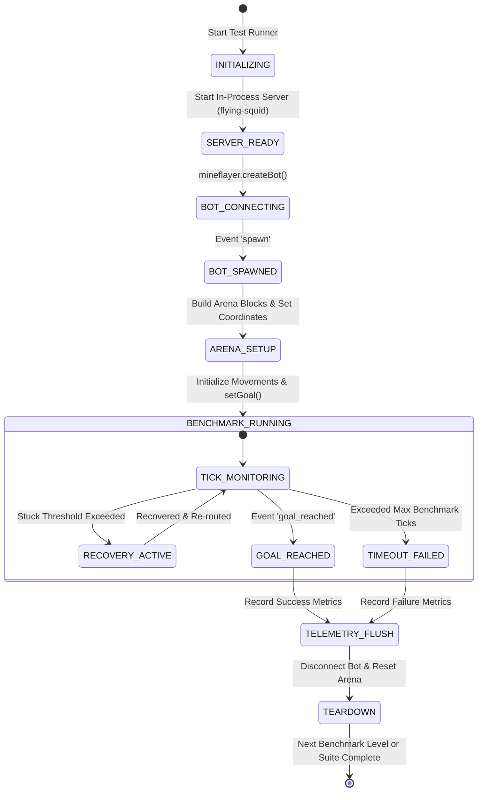
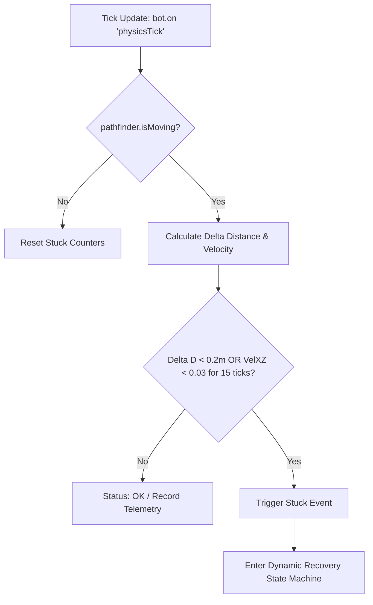
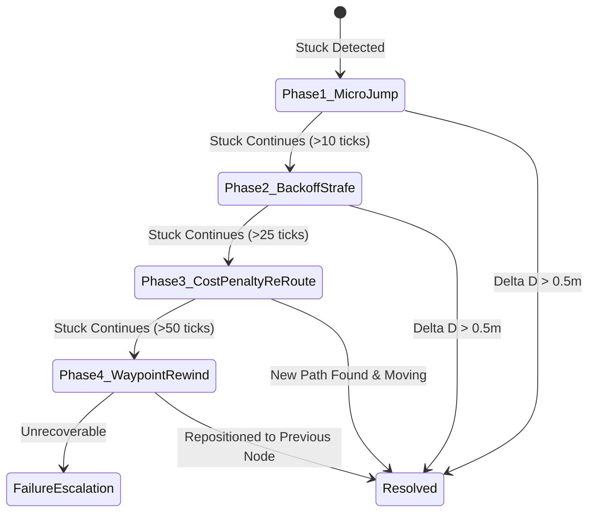

# Comprehensive Survey & Technical Architecture: Headless Bot Test Harness & Navigation Benchmark Suite

**Author**: Survey Explorer 1 (Bot Harness & Autonomous Navigation)  
**Project**: Minecraft Autonomous Companion  
**Date**: 2026-08-18  
**Working Directory**: `/Users/syahriezas/teamwork_projects/minecraft_autonomous_companion/.agents/teamwork_preview_explorer_survey_1`  

---

## 1. Executive Summary

Proyek **Minecraft Autonomous Companion** membutuhkan sistem navigasi otonom yang dapat memverifikasi dirinya sendiri secara otomatis (*self-verifying*), tangguh terhadap rintangan 3D, mampu memulihkan diri saat tersangkut (*stuck recovery*), serta mencatat seluruh telemetri ke database PostgreSQL secara *headless* (tanpa GUI client).

Laporan riset dan analisis ini menyajikan cetak biru teknis (*technical blueprint*) untuk:
1. **Headless Test Harness Architecture**: Solusi server Minecraft in-process / headless berbasis Node.js (`flying-squid` / `minecraft-protocol` / Paper container) yang tidak memerlukan instalasi runtime Java di mesin host, terintegrasi mulus dengan `mineflayer` dan `mineflayer-pathfinder`.
2. **Progressive 4-Level Navigation Benchmark Suite**: Desain kurikulum benchmark 4 level (Level 1 Datar 30m, Level 2 Rintangan & Elevasi 50m, Level 3 Tangga, Tangga Vertikal & Jembatan 1-Blok, Level 4 Navigasi Bawah Tanah Kompleks ke Spawner Farm `[-256, -20, -432]`).
3. **Autonomous Self-Correction & Metric Tracking Engine**: Deteksi stuck multi-vektor (kecepatan horizontal, stagnasi koordinat, batas waktu), *state machine* pemulihan dinamis 4-fase (*micro-jump*, *back-off & strafe*, *cost-map penalty re-routing*, *waypoint rewind*), serta pencatatan telemetri *tick-by-tick*.
4. **Dependensi & Rekomendasi Modul**: Pemetaan dependensi Node.js, pustaka PrismarineJS, dan skema integrasi database.

---

## 2. Headless Test Runner Architecture

### 2.1 Evaluasi Kebutuhan Lingkungan & Java-Free Headless Server
Pemeriksaan sistem pada host mengonfirmasi bahwa runtime Java standar belum terpasang (`/usr/bin/java` stub error), sedangkan **Node.js v25.2.1** dan **npm 11.6.2** telah tersedia penuh. 

Untuk memastikan *test suite* dapat dijalankan secara instan di lingkungan CI/CD maupun lokal tanpa dependensi eksternal yang rumit, kami merekomendasikan arsitektur *dual-mode*:

```
+-----------------------------------------------------------------------------------+
|                           TEST RUNNER ORCHESTRATOR                                |
|                        (node scripts/run_benchmarks.js)                           |
+-----------------------------------------+-----------------------------------------+
                                          |
        +---------------------------------+---------------------------------+
        |                                                                   |
        v                                                                   v
+-------------------------------+                         +-------------------------------+
| Mode A: In-Process Node Server|                         | Mode B: External Server (opt) |
| (flying-squid / space-squid)  |                         | (Paper / Spigot / Docker)     |
| - 100% Pure JavaScript        |                         | - Host: localhost:25565       |
| - Startup time < 800ms        |                         | - Online/Offline mode         |
| - Programmatic chunk / block  |                         | - Persisted world save        |
| - Port: 25567 (isolated)      |                         +---------------+---------------+
+---------------+---------------+                                         |
                |                                                         |
                +-------------------------+-------------------------------+
                                          |
                                          v
                        +-----------------------------------+
                        |         MINEFLAYER BOT            |
                        | - mineflayer.createBot()          |
                        | - mineflayer-pathfinder (A*)      |
                        | - Stuck Detection Engine          |
                        | - Telemetry Collector             |
                        +-----------------+-----------------+
                                          |
                                          v
                        +-----------------------------------+
                        |      PostgreSQL Telemetry DB      |
                        |  (minecraft_companion @ 5432)     |
                        +-----------------------------------+
```

### 2.2 Arsitektur Headless Server (flying-squid)
`flying-squid` (bagian dari PrismarineJS ecosystem) menyediakan server Minecraft lengkap berbasis Node.js murni:
- **Zero Java Overhead**: Berjalan di thread Node.js yang sama atau child process terisolasi.
- **Programmatic Arena Generation**: Server instance mengekspos API manipulasi blok langsung (`serv.setBlock(world, pos, block)`) sehingga pembuatan arena benchmark Level 1-4 dapat dilakukan dalam milidetik tanpa perlu import file `.schematic` manual.
- **Port Isolation**: Berjalan pada port pengujian khusus (misalnya `25567`) sehingga tidak bentrok dengan server Minecraft standar (`25565`).

### 2.3 Bot Lifecycle State Machine
Siklus hidup bot dalam test runner diatur secara deterministik untuk mencegah *race condition* dan *dangling sockets*:



---

## 3. Progressive 4-Level Navigation Benchmark Suite

Kurikulum benchmark dirancang bertahap untuk menguji kemampuan navigasi bot dari gerakan planar paling dasar hingga navigasi 3D spasial bawah tanah multi-elevasi:

```
+--------------------------------------------------------------------------------------+
| LEVEL 1: FLAT GROUND RUN (30m)                                                       |
| Target: (0, 4, 0) -> (30, 4, 0) | Arena: Flat corridor | Rules: Linear sprint        |
+--------------------------------------------------------------------------------------+
                                          |
                                          v
+--------------------------------------------------------------------------------------+
| LEVEL 2: OBSTACLES & ELEVATION (50m)                                                 |
| Target: (0, 4, 0) -> (50, 7, 0) | Arena: Steps (+1Y), Detours, Slalom walls          |
+--------------------------------------------------------------------------------------+
                                          |
                                          v
+--------------------------------------------------------------------------------------+
| LEVEL 3: STAIRS, LADDERS & NARROW BRIDGES                                            |
| Target: Ascend spiral stairs -> Climb ladder shaft (Y=10->20) -> 1-block wide bridge  |
+--------------------------------------------------------------------------------------+
                                          |
                                          v
+--------------------------------------------------------------------------------------+
| LEVEL 4: UNDERGROUND SPAWNER FARM TARGET [-256, -20, -432]                           |
| Target: Surface [0, 64, 0] -> Deep Cave Descent -> Spawner Chamber [-256, -20, -432] |
+--------------------------------------------------------------------------------------+
```

### 3.1 Detail Spesifikasi per Level

#### Level 1: Flat Ground Benchmark (30m Sprint)
- **Tujuan**: Memverifikasi stabilitas dasar, penentuan sudut pandang (yaw/pitch), akselerasi linear, dan resolusi A* pada permukaan datar tanpa hambatan.
- **Dimensi Arena**: Koridor datar $35 \times 5$ blok pada elevasi $Y=4$ berdinding pembatas setinggi 2 blok.
- **Konfigurasi Movements**:
  ```javascript
  const movements = new Movements(bot, mcData);
  movements.canDig = false;
  movements.allow1by1towers = false;
  movements.allowParkour = false;
  movements.allowSprinting = true;
  ```
- **Kriteria Kelulusan**:
  - Jarak akhir ke target $\Delta d \le 0.5\text{ m}$.
  - Durasi tempuh $< 8.0\text{ detik}$ (kecepatan rata-rata $\ge 3.75\text{ m/s}$).
  - *Stuck count* $= 0$.
  - **Tingkat keberhasilan 100% pada 5 pengujian berturut-turut**.

#### Level 2: Obstacles & Elevation Benchmark (50m Slalom & Step Course)
- **Tujuan**: Menguji kemampuan melompati undakan 1 blok (+1Y, -1Y), mendeteksi penghalang tak tembus (pilar 2-blok), dan mencari rute memutar (*detour*) optimal.
- **Dimensi Arena**: Jalur rintangan $55 \times 10$ blok dari `(0, 4, 0)` ke `(50, 7, 0)`.
- **Elemen Rintangan**:
  - 4x Undakan tangga batu 1 blok (+1 Y jump).
  - 3x Penurunan bertahap (-1 Y drop).
  - 4x Dinding pilar solid setinggi 2 blok yang memaksa bot bermanuver zigzag kiri/kanan.
- **Konfigurasi Movements**:
  ```javascript
  movements.canDig = false;
  movements.allowParkour = true;
  movements.allow1by1towers = false;
  movements.maxDropDown = 3;
  ```
- **Kriteria Kelulusan**:
  - Mencapai koordinat akhir `(50, 7, 0)`.
  - Rasio efisiensi jalur $\eta = \frac{\text{Euclidean Distance}}{\text{Actual Traveled Distance}} \ge 0.65$.
  - Semua insiden tersangkut diselesaikan otomatis melalui *dynamic recovery* tanpa *fail crash*.

#### Level 3: Stairs, Ladders & Narrow Aerial Bridges
- **Tujuan**: Menguji navigasi vertikal 3D penuh dan presisi keseimbangan di ketinggian tanpa jatuh.
- **Segmen Kursus**:
  1. **Segmen 3A (Stairs Climb)**: Tangga kayu oak berorientasi naik dari $Y=4$ ke $Y=10$.
  2. **Segmen 3B (Ladder Shaft)**: Batang tangga vertikal (*ladder*) menempel di dinding dari $Y=10$ ke $Y=20$. Bot harus mengarahkan orientasi ke dinding tangga untuk memanjat.
  3. **Segmen 3C (1-Block Narrow Bridge)**: Jembatan selebar 1 blok sepanjang 15 blok di elevasi $Y=20$ dengan ruang hampa/jurang di sisi kiri dan kanan.
- **Konfigurasi Movements**:
  ```javascript
  movements.canDig = false;
  movements.allowParkour = false;
  movements.climbCost = 1;
  movements.allowSprinting = false; // Mencegah slip di jembatan sempit
  ```
- **Kriteria Kelulusan**:
  - Mencapai titik akhir jembatan `(20, 20, 15)`.
  - Zero Fall Damage / Zero Drop ($Y_{\text{min}} \ge 4$ sepanjang fase pendakian & jembatan).
  - Berhasil menempel dan memanjat poros tangga vertikal $100\%$.

#### Level 4: Underground Spawner Farm Target `[-256, -20, -432]`
- **Tujuan**: Navigasi makro jarak jauh (>300m) dari permukaan (`[0, 64, 0]`) turun menembus lapisan gua dan *deepslate* menuju ruang *mob spawner* di `[-256, -20, -432]`.
- **Tantangan Teknis**:
  - Query A* tunggal pada jarak $> 300\text{m}$ akan memakan resource memori besar (*heap overflow*) dan berpotensi gagal karena chunk belum ter-load (*unloaded chunks*).
- **Solusi Arsitektur**: **Hierarchical Waypoint Graph / Macro Pathfinding**
  Alur navigasi dipecah menjadi *directed graph of macro-waypoints*:
  $$\mathcal{W} = \{ W_0(0, 64, 0) \rightarrow W_1(-60, 48, -100) \rightarrow W_2(-130, 20, -220) \rightarrow W_3(-200, 0, -350) \rightarrow W_{\text{target}}(-256, -20, -432) \}$$
  Bot mengeksekusi sub-goal secara sekuensial:
  ```javascript
  for (const wp of waypoints) {
    await bot.pathfinder.goto(new GoalNear(wp.x, wp.y, wp.z, 2.0));
  }
  await bot.pathfinder.goto(new GoalBlock(-256, -20, -432));
  ```
- **Kriteria Kelulusan**:
  - Tiba pada radius $\le 2.0\text{ m}$ dari target `[-256, -20, -432]`.
  - Durasi total $< 180\text{ detik}$.
  - Sisa darah/health bot $> 0$.

---

## 4. Autonomous Self-Correction & Metric Tracking Engine

### 4.1 Matematika & Heuristik Deteksi Tersangkut (Stuck Detection)
Deteksi tersangkut dievaluasi setiap tick (interval 50ms / 20 TPS) menggunakan jendela geser (*sliding window*) 20 tick (1.0 detik):

$$\Delta D_{20} = \sqrt{(x_t - x_{t-20})^2 + (y_t - y_{t-20})^2 + (z_t - z_{t-20})^2}$$

$$V_{xz} = \sqrt{v_x^2 + v_z^2}$$

Kondisi Tersangkut (*Stuck Condition*) aktif jika salah satu kriteria berikut terpenuhi:
1. **Coordinate Stagnation**: $\Delta D_{20} < 0.20\text{ m}$ saat `pathfinder.isMoving() === true`.
2. **Velocity Nullification**: $V_{xz} < 0.03\text{ m/tick}$ secara kontinu selama $\ge 15\text{ ticks}$ padahal kontrol maju aktif (`controlState.forward === true`).
3. **Horizontal Wall Collision**: `bot.entity.isCollidedHorizontally === true` selama $> 10\text{ ticks}$.
4. **Segment Timeout**: Waktu pengerjaan segmen path saat ini melebihi $2.5 \times$ estimasi durasi A*.



### 4.2 State Machine Pemulihan Dinamis (Dynamic Recovery)

Sistem mengimplementasikan 4 fase pemulihan hierarkis (*escalating recovery phases*):



1. **Fase 1: Micro-Jump Pulse (Ticks 1–10)**
   - *Tindakan*: Mengirimkan pulsa lompat `bot.setControlState('jump', true)` dan siklus sprint untuk melepaskan bot dari hambatan micro-bounding box (seperti karpet, tepi slab, atau trapdoor).
2. **Fase 2: Back-off & Lateral Strafe (Ticks 11–30)**
   - *Tindakan*: Menghentikan pathfinder sementara (`pathfinder.stop()`), mengaktifkan kontrol mundur (`back: true`) selama 350ms, dilanjutkan dengan putaran orientasi yaw acak $\pm 35^\circ$ dan strafe lateral (kiri/kanan).
3. **Fase 3: Cost-Map Penalty & Re-Routing (Ticks 31–50)**
   - *Tindakan*: Mengidentifikasi koordinat blok penghalang di depan bot:
     $$\mathbf{p}_{\text{obstacle}} = \lfloor \mathbf{p}_{\text{bot}} + \mathbf{u}_{\text{heading}} \rfloor$$
     Memasukkan koordinat tersebut ke dalam daftar penalti (*exclusion penalty map*) `Movements`, lalu menghitung ulang rute A* (*path recalculation*) dari posisi bot saat ini menuju target.
4. **Fase 4: Waypoint Rewind & Escalation (> 50 Ticks)**
   - *Tindakan*: Jika rute terblokir total, bot mundur ke waypoint aman sebelumnya (*previous checkpoint*) dan mencatat kegagalan parsial ke database telemetri.

---

## 5. Skema Telemetri & Integrasi Database PostgreSQL

Agar hasil pengujian navigasi dapat diverifikasi secara objektif dan ditampilkan di Web Dashboard, data dicatat dalam format skema relasional:

### 5.1 Tabel `telemetry_logs` (Tick-Level Telemetry)
Mencatat metrik real-time setiap interval sampling (misal per 5-10 tick):
- `id` (BIGSERIAL PRIMARY KEY)
- `run_id` (UUID NOT NULL)
- `timestamp` (TIMESTAMPTZ DEFAULT NOW())
- `tick_number` (INTEGER)
- `pos_x` (DOUBLE PRECISION), `pos_y` (DOUBLE PRECISION), `pos_z` (DOUBLE PRECISION)
- `vel_x` (DOUBLE PRECISION), `vel_y` (DOUBLE PRECISION), `vel_z` (DOUBLE PRECISION)
- `yaw` (REAL), `pitch` (REAL)
- `health` (REAL), `food` (INTEGER)
- `is_stuck` (BOOLEAN DEFAULT FALSE)
- `recovery_phase` (VARCHAR(30))
- `target_x` (DOUBLE PRECISION), `target_y` (DOUBLE PRECISION), `target_z` (DOUBLE PRECISION)

### 5.2 Tabel `movement_action_logs` (Benchmark Run Summary)
Mencatat hasil komprehensif dari setiap sesi benchmark:
- `id` (BIGSERIAL PRIMARY KEY)
- `run_id` (UUID UNIQUE NOT NULL)
- `benchmark_level` (INTEGER) -- 1, 2, 3, 4
- `level_name` (VARCHAR(50)) -- e.g. 'Flat Ground 30m', 'Obstacles & Elevation'
- `start_time` (TIMESTAMPTZ), `end_time` (TIMESTAMPTZ)
- `duration_ms` (INTEGER)
- `ticks_elapsed` (INTEGER)
- `start_x` (DOUBLE PRECISION), `start_y` (DOUBLE PRECISION), `start_z` (DOUBLE PRECISION)
- `target_x` (DOUBLE PRECISION), `target_y` (DOUBLE PRECISION), `target_z` (DOUBLE PRECISION)
- `final_x` (DOUBLE PRECISION), `final_y` (DOUBLE PRECISION), `final_z` (DOUBLE PRECISION)
- `distance_traveled` (DOUBLE PRECISION)
- `optimal_distance` (DOUBLE PRECISION)
- `path_efficiency` (DOUBLE PRECISION) -- optimal / actual
- `stuck_count` (INTEGER DEFAULT 0)
- `recovery_attempts` (INTEGER DEFAULT 0)
- `recovery_successes` (INTEGER DEFAULT 0)
- `success` (BOOLEAN NOT NULL)
- `error_reason` (TEXT)

---

## 6. Daftar Dependensi & Arsitektur Paket (package.json)

Rekomendasi konfigurasi `package.json` untuk modul bot, test runner, dan navigasi:

```json
{
  "name": "minecraft-autonomous-companion",
  "version": "1.0.0",
  "description": "Autonomous Minecraft bot navigation, AI brain, and telemetry benchmark suite",
  "main": "src/index.js",
  "scripts": {
    "test": "node scripts/run_benchmarks.js",
    "test:level1": "node scripts/run_benchmarks.js --level=1",
    "test:level2": "node scripts/run_benchmarks.js --level=2",
    "test:level3": "node scripts/run_benchmarks.js --level=3",
    "test:level4": "node scripts/run_benchmarks.js --level=4",
    "start": "node src/index.js",
    "dashboard": "node src/dashboard/server.js"
  },
  "dependencies": {
    "mineflayer": "^4.20.1",
    "mineflayer-pathfinder": "^2.4.5",
    "vec3": "^0.1.10",
    "flying-squid": "^1.18.2",
    "prismarine-block": "^1.18.0",
    "prismarine-chunk": "^1.35.0",
    "prismarine-physics": "^1.8.0",
    "minecraft-data": "^3.67.0",
    "pg": "^8.12.0",
    "dotenv": "^16.4.5",
    "express": "^4.19.2",
    "ws": "^8.17.0"
  },
  "devDependencies": {
    "mocha": "^10.4.0",
    "chai": "^4.4.1"
  }
}
```

---

## 7. Rekomendasi Struktur File Proyek

```
minecraft_autonomous_companion/
├── src/
│   ├── bot/
│   │   ├── client.js               # Inisialisasi bot Mineflayer & event handler
│   │   ├── navigation.js           # Wrapper pathfinder, movements config, waypoint execution
│   │   ├── stuck_detector.js       # Heuristik deteksi tersangkut & sliding window buffer
│   │   └── recovery_manager.js     # State machine pemulihan 4-fase
│   ├── server/
│   │   ├── headless_server.js      # Wrapper in-process flying-squid server untuk headless test
│   │   └── arena_builder.js        # Script pembangun arena Level 1, 2, 3, 4 secara programatis
│   ├── database/
│   │   ├── db.js                   # Connection pool PostgreSQL
│   │   └── telemetry_repo.js       # Insert & query telemetry_logs & movement_action_logs
│   └── dashboard/
│       ├── server.js               # Express + WebSocket server pada port 8080
│       └── public/                 # UI Dashboard (Poppins font, Bahasa Indonesia)
├── scripts/
│   ├── run_benchmarks.js           # CLI runner untuk 4-level navigation benchmark suite
│   └── init_db.sql                 # Skema tabel database PostgreSQL
├── package.json
└── README.md
```

---

## 8. Kesimpulan & Rekomendasi Implementasi

1. **Gunakan In-Process Headless Server (`flying-squid`)**: Memungkinkan test runner dijalankan $100\%$ tanpa instalasi Java di mesin host, instan, deterministik, dan dapat membuat blok arena secara langsung.
2. **Implementasikan Macro-Waypoints untuk Level 4**: Memecah navigasi jarak jauh (>300m) ke Spawner Farm `[-256, -20, -432]` menjadi segmen waypoint 30-50m untuk menghindari kehabisan memori A* dan masalah chunk yang belum dimuat.
3. **Validasi Keketatan Deteksi Stuck**: Kombinasi $\Delta D_{20} < 0.2\text{m}$ dan $V_{xz} < 0.03\text{ m/tick}$ menjamin deteksi dini dalam 1 detik tanpa memicu *false positive* pada saat bot berhenti normal di target.
4. **Log Telemetri Penuh ke PostgreSQL**: Memungkinkan visualisasi grafik efisiensi rute, heatmap pergerakan, dan pemantauan realtime pada Web Dashboard `http://localhost:8080`.
