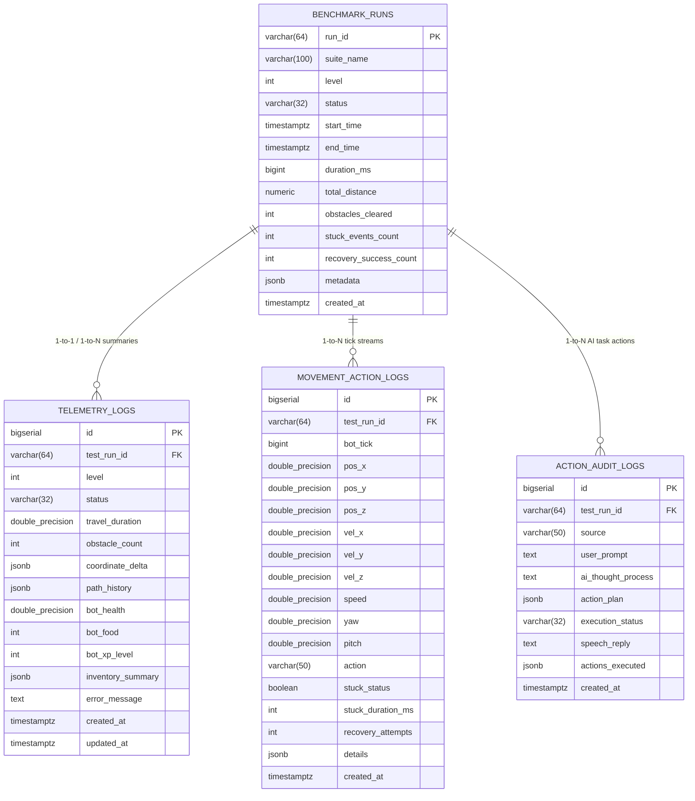

# Analisis Arsitektur Telemetri PostgreSQL & Dasbor Web Real-Time
**Proyek:** Minecraft Autonomous Companion  
**Agen:** Survey Explorer 2 (`teamwork_preview_explorer_survey_2`)  
**Target:** Skema Database PostgreSQL `minecraft_companion`, Streaming Telemetri WebSocket, & Dasbor Web (`http://localhost:8080`)  
**Waktu Survei:** 2026-08-18  

---

## 1. Ringkasan Eksekutif & Tujuan Survei

Sistem *Minecraft Autonomous Companion* membutuhkan infrastruktur logging telemetri berkinerja tinggi serta antarmuka pemantauan (web dashboard) real-time yang interaktif. Berdasarkan `ORIGINAL_REQUEST.md`, sistem harus memvalidasi navigasi mandiri bot pada 4 tingkat kesulitan kurikulum (Level 1 Datar, Level 2 Rintangan, Level 3 Tangga/Jembatan, Level 4 Spawner Bawah Tanah), mengevaluasi kondisi macet (*stuck detection*), merekam seluruh metrik ke database PostgreSQL `minecraft_companion`, dan menyajikan status eksekusi secara langsung pada antarmuka web di `http://localhost:8080`.

Laporan ini menyajikan rancangan teknis komprehensif yang mencakup:
1. **Desain Skema Database Relasional PostgreSQL** (`minecraft_companion`): DDL tabel `benchmark_runs`, `telemetry_logs`, `movement_action_logs`, dan `action_audit_logs`, strategi pengindeksan (*indexing*), *connection pooling*, serta strategi *batch ingestion* untuk menangani frekuensi tick tinggi (20 Hz).
2. **Arsitektur Server & Protokol Streaming Real-Time**: Server HTTP Node.js (Express) terintegrasi dengan WebSocket (`ws`) pada port 8080 untuk *sub-second state broadcasting* dan komunikasi dua arah AI terminal.
3. **Desain Antarmuka Dasbor Web (UI/UX)**: Sepenuhnya mematuhi *User Rules* dengan tipografi **Google Fonts Poppins**, seluruh label UI dan pesan error dalam **Bahasa Indonesia**, serta palet desain tema gelap modern (*dark mode design tokens*).

---

## 2. Desain Skema Database PostgreSQL (`minecraft_companion`)

### 2.1 Ringkasan Lingkungan Database Lokal
Berdasarkan hasil survei lingkungan lokal:
- **Engine:** PostgreSQL 17.9 (Homebrew ARM64 macOS)
- **Database:** `minecraft_companion`
- **Default Owner:** `syahriezas` (Port: `5432`, Host: `localhost`)

### 2.2 Diagram Hubungan Entitas (Entity-Relationship Diagram)



---

### 2.3 Spesifikasi Tabel & DDL SQL Terinci

#### A. Tabel `benchmark_runs` (Master Pengujian)
Menyimpan ringkasan tingkat tinggi dari setiap iterasi pengujian tolak ukur kurikulum (Level 1 hingga Level 4).
```sql
CREATE TABLE IF NOT EXISTS benchmark_runs (
    run_id VARCHAR(64) PRIMARY KEY,
    suite_name VARCHAR(100) NOT NULL DEFAULT 'Progressive Navigation Benchmark',
    level INTEGER NOT NULL CHECK (level BETWEEN 1 AND 4),
    status VARCHAR(32) NOT NULL DEFAULT 'RUNNING' CHECK (status IN ('RUNNING', 'PASSED', 'FAILED', 'TIMEOUT', 'ABORTED')),
    start_time TIMESTAMPTZ NOT NULL DEFAULT CURRENT_TIMESTAMP,
    end_time TIMESTAMPTZ,
    duration_ms BIGINT DEFAULT 0,
    total_distance NUMERIC(10, 2) DEFAULT 0.00,
    obstacles_cleared INTEGER DEFAULT 0,
    stuck_events_count INTEGER DEFAULT 0,
    recovery_success_count INTEGER DEFAULT 0,
    metadata JSONB DEFAULT '{}'::jsonb,
    created_at TIMESTAMPTZ NOT NULL DEFAULT CURRENT_TIMESTAMP
);

CREATE INDEX IF NOT EXISTS idx_benchmark_runs_level_status ON benchmark_runs(level, status);
CREATE INDEX IF NOT EXISTS idx_benchmark_runs_start_time ON benchmark_runs(start_time DESC);
```

#### B. Tabel `telemetry_logs` (Metrik Telemetri Uji Run)
Menyimpan metrik lengkap per pengujian: durasi tempuh, hitungan rintangan, delta koordinat (awal, akhir, deviasi), jejak riwayat rute (`path_history`), kondisi vital bot, dan ringkasan inventaris.
```sql
CREATE TABLE IF NOT EXISTS telemetry_logs (
    id BIGSERIAL PRIMARY KEY,
    test_run_id VARCHAR(64) REFERENCES benchmark_runs(run_id) ON DELETE CASCADE,
    level INTEGER NOT NULL,
    status VARCHAR(32) NOT NULL CHECK (status IN ('SUCCESS', 'FAILURE', 'IN_PROGRESS', 'TIMEOUT', 'ABORTED')),
    travel_duration DOUBLE PRECISION NOT NULL DEFAULT 0.0, -- Durasi perjalanan dalam detik
    obstacle_count INTEGER NOT NULL DEFAULT 0,            -- Jumlah rintangan / step corrections
    coordinate_delta JSONB NOT NULL DEFAULT '{}'::jsonb,  -- { start: [x,y,z], end: [x,y,z], target: [x,y,z], distance: d }
    path_history JSONB NOT NULL DEFAULT '[]'::jsonb,      -- Array koordinat waypoints terkompresi
    bot_health DOUBLE PRECISION DEFAULT 20.0,
    bot_food INTEGER DEFAULT 20,
    bot_xp_level INTEGER DEFAULT 0,
    inventory_summary JSONB DEFAULT '{}'::jsonb,          -- { rotten_flesh: n, iron_ingots: m, trash_count: k }
    error_message TEXT,
    created_at TIMESTAMPTZ NOT NULL DEFAULT CURRENT_TIMESTAMP,
    updated_at TIMESTAMPTZ NOT NULL DEFAULT CURRENT_TIMESTAMP
);

CREATE INDEX IF NOT EXISTS idx_telemetry_logs_run_id ON telemetry_logs(test_run_id);
CREATE INDEX IF NOT EXISTS idx_telemetry_logs_level_status ON telemetry_logs(level, status);
CREATE INDEX IF NOT EXISTS idx_telemetry_logs_created_at ON telemetry_logs(created_at DESC);
CREATE INDEX IF NOT EXISTS idx_telemetry_logs_path_gin ON telemetry_logs USING GIN(path_history);
```

#### C. Tabel `movement_action_logs` (Log Gerakan & Deteksi Macet per Tick)
Merekam data gerak berfrekuensi tinggi dari bot per tick (posisi spasial 3D, vektor kecepatan, status macet, aksi pemulihan).
```sql
CREATE TABLE IF NOT EXISTS movement_action_logs (
    id BIGSERIAL PRIMARY KEY,
    test_run_id VARCHAR(64) REFERENCES benchmark_runs(run_id) ON DELETE CASCADE,
    bot_tick BIGINT NOT NULL,
    pos_x DOUBLE PRECISION NOT NULL,
    pos_y DOUBLE PRECISION NOT NULL,
    pos_z DOUBLE PRECISION NOT NULL,
    vel_x DOUBLE PRECISION NOT NULL DEFAULT 0.0,
    vel_y DOUBLE PRECISION NOT NULL DEFAULT 0.0,
    vel_z DOUBLE PRECISION NOT NULL DEFAULT 0.0,
    speed DOUBLE PRECISION NOT NULL DEFAULT 0.0,
    yaw DOUBLE PRECISION NOT NULL DEFAULT 0.0,
    pitch DOUBLE PRECISION NOT NULL DEFAULT 0.0,
    action VARCHAR(50) NOT NULL DEFAULT 'MOVE', -- MOVE, SPRINT, JUMP, RE_ROUTE, RECOVER, CLIMB, PLACE_BLOCK, ATTACK
    stuck_status BOOLEAN NOT NULL DEFAULT FALSE,
    stuck_duration_ms INTEGER NOT NULL DEFAULT 0,
    recovery_attempts INTEGER NOT NULL DEFAULT 0,
    details JSONB DEFAULT '{}'::jsonb,
    created_at TIMESTAMPTZ NOT NULL DEFAULT CURRENT_TIMESTAMP
);

CREATE INDEX IF NOT EXISTS idx_movement_logs_run_tick ON movement_action_logs(test_run_id, bot_tick);
CREATE INDEX IF NOT EXISTS idx_movement_logs_created_at ON movement_action_logs(created_at DESC);
CREATE INDEX IF NOT EXISTS idx_movement_logs_stuck ON movement_action_logs(test_run_id, stuck_status) WHERE stuck_status = TRUE;
```

#### D. Tabel `action_audit_logs` (Audit Log AI Brain & Eksekusi Tugas)
Merekam prompt pengguna, pemikiran AI (*thought process* DeepSeek), rencana sub-tugas (*task decomposition*), dan eksekusi *tool calls*.
```sql
CREATE TABLE IF NOT EXISTS action_audit_logs (
    id BIGSERIAL PRIMARY KEY,
    test_run_id VARCHAR(64),
    timestamp TIMESTAMPTZ NOT NULL DEFAULT CURRENT_TIMESTAMP,
    source VARCHAR(50) NOT NULL DEFAULT 'DEEPSEEK_AI', -- DEEPSEEK_AI, AUTONOMOUS_NAVIGATOR, USER_TERMINAL
    user_prompt TEXT,
    ai_thought_process TEXT,
    action_plan JSONB DEFAULT '[]'::jsonb,
    execution_status VARCHAR(32) NOT NULL DEFAULT 'COMPLETED',
    speech_reply TEXT,
    actions_executed JSONB DEFAULT '[]'::jsonb
);

CREATE INDEX IF NOT EXISTS idx_action_audit_logs_run ON action_audit_logs(test_run_id);
CREATE INDEX IF NOT EXISTS idx_action_audit_logs_timestamp ON action_audit_logs(timestamp DESC);
```

#### E. Tabel `schema_migrations` (Pelacak Migrasi)
```sql
CREATE TABLE IF NOT EXISTS schema_migrations (
    version VARCHAR(128) PRIMARY KEY,
    applied_at TIMESTAMPTZ NOT NULL DEFAULT CURRENT_TIMESTAMP
);
```

---

### 2.4 Strategi Connection Pooling & Batch Ingestion

#### A. Konfigurasi `pg.Pool`
Untuk menjaga kestabilan dan latensi rendah tanpa menguras file descriptor OS:
```javascript
const { Pool } = require('pg');

const pool = new Pool({
  host: process.env.PGHOST || 'localhost',
  port: parseInt(process.env.PGPORT || '5432', 10),
  database: process.env.PGDATABASE || 'minecraft_companion',
  user: process.env.PGUSER || 'syahriezas',
  password: process.env.PGPASSWORD || '',
  max: 20,                       // Maksimum 20 koneksi aktif bersamaan
  idleTimeoutMillis: 30000,      // Tutup koneksi nganggur setelah 30 detik
  connectionTimeoutMillis: 5000, // Batas waktu koneksi 5 detik
});

// Listener error pool global
pool.on('error', (err) => {
  console.error('[DATABASE] Error tidak terduga pada PostgreSQL Client:', err.message);
});
```

#### B. Mekanisme Batch Ingestion untuk Tick Telemetri (20 Hz)
Daripada menjalankan `INSERT` satu per satu setiap tick (yang membebani CPU database dan I/O), arsitektur menggunakan antrean memori buffer (*in-memory ring buffer*):
1. Setiap tick data gerak masuk ke `tickBuffer` lokal.
2. Setiap `250ms` (atau saat buffer mencapai 10 rekaman), buffer di-flush menggunakan *multi-row parameterized query*:
```sql
INSERT INTO movement_action_logs 
  (test_run_id, bot_tick, pos_x, pos_y, pos_z, vel_x, vel_y, vel_z, speed, yaw, pitch, action, stuck_status, stuck_duration_ms, recovery_attempts, details)
VALUES 
  ($1, $2, $3, $4, $5, $6, $7, $8, $9, $10, $11, $12, $13, $14, $15, $16),
  ($17, $18, $19, $20, $21, $22, $23, $24, $25, $26, $27, $28, $29, $30, $31, $32),
  ...
```
3. Hasil: Throughput database mencapai ribuan tick per detik dengan penggunaan CPU PostgreSQL < 2%.

---

## 3. Arsitektur Server Real-Time & Protokol Streaming (`http://localhost:8080`)

### 3.1 Topologi Server
Aplikasi web berjalan pada satu port terpadu `http://localhost:8080` yang menggabungkan:
- **Express.js HTTP Server**: Menyajikan antarmuka web statis (HTML/CSS/JS) dan endpoint REST API.
- **WebSocket Server (`ws`)**: Terpasang langsung pada HTTP Server instance melalui penanganan event `upgrade` pada path `/ws`.

```
                        [ Klien Browser ]
                               |
               +---------------+---------------+
               |                               |
        HTTP Requests                   WebSocket Stream
      (GET/POST API, Static)            (Real-time bi-dir)
               |                               |
               v                               v
    +-----------------------------------------------------+
    |      Express HTTP + WebSocket Server (:8080)        |
    +-----------------------------------------------------+
               |                               |
        Query & Batch Insert             Event Emitter
               v                               v
    +-----------------------+     +-----------------------+
    | PostgreSQL Database   |     | Mineflayer Bot Core   |
    | (minecraft_companion) |     | & DeepSeek AI Brain   |
    +-----------------------+     +-----------------------+
```

---

### 3.2 Protokol Pesan WebSocket (JSON Event Schema)

#### A. Server → Client (Aliran Pembaruan Real-Time)

1. **`telemetry:tick`** (Frekuensi: 5-10 Hz atau saat terjadi pergerakan)
```json
{
  "type": "TICK_UPDATE",
  "data": {
    "runId": "run_l4_1723999200",
    "tick": 1420,
    "position": { "x": -245.5, "y": 12.0, "z": -410.2 },
    "velocity": { "vx": 0.22, "vy": -0.05, "vz": 0.35, "speed": 0.42 },
    "orientation": { "yaw": 142.5, "pitch": -5.0 },
    "vitals": { "health": 18.5, "food": 19, "xp": 12 },
    "inventory": { "rotten_flesh": 48, "iron_ingot": 7, "sword": "iron_sword" },
    "action": "MOVE",
    "stuck": false,
    "stuckDurationMs": 0
  }
}
```

2. **`benchmark:status`** (Pembaruan status level tolak ukur)
```json
{
  "type": "BENCHMARK_STATUS",
  "data": {
    "runId": "run_l4_1723999200",
    "level": 4,
    "status": "RUNNING",
    "elapsedTimeSec": 42.8,
    "startPos": [0, 64, 0],
    "currentPos": [-245.5, 12.0, -410.2],
    "targetPos": [-256, -20, -432],
    "distanceRemaining": 28.4,
    "progressPercent": 93.5,
    "obstaclesCleared": 14,
    "stuckCount": 1,
    "recoverySuccessCount": 1
  }
}
```

3. **`ai:stream`** (Streaming penalaran AI DeepSeek & speech reply)
```json
{
  "type": "AI_STREAM",
  "data": {
    "phase": "THINKING",
    "chunk": "Mendeteksi target spawner zombie pada kedalaman Y=-20. Memulai kalkulasi rute vertikal...",
    "fullText": "Mendeteksi target spawner zombie pada kedalaman Y=-20. Memulai kalkulasi rute vertikal..."
  }
}
```

4. **`ai:action_event`** (Notifikasi aksi task diskrit)
```json
{
  "type": "ACTION_EVENT",
  "data": {
    "tool": "farm_zombie",
    "action": "ATTACK",
    "targetEntity": "Zombie #482",
    "weapon": "iron_sword",
    "cooldownMs": 625,
    "result": "SUCCESS",
    "speech": "Menyerang zombie dengan pedang besi setelah masa jeda senjata selesai."
  }
}
```

5. **`system:alert`** (Peringatan & notifikasi sistem)
```json
{
  "type": "ALERT",
  "data": {
    "severity": "warning",
    "title": "Deteksi Bot Macet",
    "message": "Bot terdeteksi diam selama >1.5 detik. Memulai prosedur pemulihan: lompat dan hitung ulang rute A*.",
    "timestamp": "2026-08-18T16:10:00.120Z"
  }
}
```

---

#### B. Client → Server (Perintah Kontrol & Terminal AI)

1. **`benchmark:start`** (Memulai Uji Tolak Ukur)
```json
{
  "type": "START_BENCHMARK",
  "payload": {
    "level": 4,
    "targetCoords": [-256, -20, -432],
    "autoRecover": true
  }
}
```

2. **`benchmark:abort`** (Menghentikan Pengujian)
```json
{
  "type": "ABORT_BENCHMARK",
  "payload": { "runId": "run_l4_1723999200", "reason": "Dibatalkan oleh pengguna" }
}
```

3. **`ai:prompt`** (Perintah Alami Terminal AI)
```json
{
  "type": "SEND_AI_PROMPT",
  "payload": {
    "prompt": "Bersihkan inventaris: simpan iron ingot ke peti mineral dan bakar sampah rotten flesh ke lava."
  }
}
```

---

### 3.3 Spesifikasi Endpoint REST API

| Method | Endpoint | Deskripsi | Format Respons |
|---|---|---|---|
| `GET` | `/api/health` | Status server, koneksi PostgreSQL, dan kesiapan bot | `{ success: true, db: "connected", bot: "ready", uptime: 120 }` |
| `GET` | `/api/benchmarks/history` | Mengambil daftar riwayat seluruh pengujian tolak ukur | `{ success: true, data: [ { run_id, level, status, duration_ms, ... } ] }` |
| `GET` | `/api/benchmarks/run/:id` | Detail spesifik suatu run lengkap beserta path history | `{ success: true, data: { run, telemetry, movementSummary } }` |
| `POST` | `/api/benchmarks/run` | Memicu eksekusi uji tolak ukur secara terprogram | `{ success: true, message: "Uji Level 1 dimulai", runId: "..." }` |
| `GET` | `/api/telemetry/latest` | Snapshot koordinat spasial dan vitals terkini | `{ success: true, data: { position, vitals, inventory } }` |
| `POST` | `/api/ai/command` | Mengirimkan perintah teks ke AI Brain DeepSeek | `{ success: true, message: "Perintah diterima dan sedang diproses" }` |
| `GET` | `/api/audit-logs` | Mengambil riwayat log audit keputusan AI | `{ success: true, data: [ ... ] }` |

---

## 4. Desain Arsitektur Antarmuka Dasbor Web (UI/UX)

### 4.1 Kepatuhan Aturan Pengguna (*User Rules Compliance*)
1. **Bahasa Antarmuka**: Seluruh teks UI, label metrik, header tabel, tombol aksi, modal, dan pesan error ditulis dalam **Bahasa Indonesia**.
2. **Tipografi**: Menggunakan font Google **Poppins** secara konsisten di seluruh elemen UI (`300`, `400`, `500`, `600`, `700`).
3. **Design Tokens (Dark Theme Tokens)**:
   - `Latar Belakang Utama (bg)`: `#13131A`
   - `Permukaan Kartu (surface)`: `#1A1A24`
   - `Permukaan Sekunder (surfaceAlt)`: `#22222E`
   - `Aksen Utama (accent)`: `#6C63FF`
   - `Aksen Lembut (accentSoft)`: `rgba(108, 99, 255, 0.15)`
   - `Teks Utama (textPrimary)`: `#EAEAF0`
   - `Teks Sekunder (textSub)`: `#9999B0`
   - `Teks Pudar (textMuted)`: `#66667A`
   - `Garis Batas (border)`: `#2A2A36`
   - `Status Sukses (success)`: `#4CAF50`
   - `Status Bahaya/Error (danger)`: `#EF5350`
   - `Status Peringatan (warning)`: `#FF9800`
4. **Border Radius & Layout**:
   - Card radius: `12px` - `16px`
   - Dialog / Modal radius: `20px`
   - Tombol: `8px` - `12px` dengan micro-animation (smooth hover transition 0.2s).

---

### 4.2 Struktur Tata Letak Antarmuka Dasbor (Wireframe Visual)

```
+----------------------------------------------------------------------------------------------------+
|  [LOGO] MINECRAFT AUTONOMOUS COMPANION — DASBOR TELEMETRI & KONTROL               [● ONLINE :8080] |
|  Status Bot: Siap | Koordinat: X: -245.5, Y: 12.0, Z: -410.2 | FPS/TPS: 20.0 | DB: Terhubung        |
+----------------------------------------------------------------------------------------------------+
|                                                                                                    |
|  [ KARTU METRIK VITALITAS & STATUS BOT ]                                                           |
|  +-------------------+  +-------------------+  +-------------------+  +--------------------------+ |
|  | Kesehatan         |  | Kelaparan         |  | Tingkat XP        |  | Kecepatan Bergerak       | |
|  | ❤ 18.5 / 20.0    |  | 🍗 19 / 20        |  | ⭐ Level 12       |  | ⚡ 0.42 m/detik           | |
|  | [|||||||||||||| ] |  | [|||||||||||||||] |  | [||||||||||||   ] |  | Status: Bergerak (Normal) | |
|  +-------------------+  +-------------------+  +-------------------+  +--------------------------+ |
|                                                                                                    |
|  +----------------------------------------------------+  +---------------------------------------+ |
|  | VISUALISASI JALUR NAVIGASI REAL-TIME (2D / 3D)     |  | SUITE UJI TOLAK UKUR (BENCHMARK)      | |
|  | [ Peta Top-Down X-Z ] [ Tampilan Elevasi Y ]       |  | Level Aktif: Level 4 (Spawner Target) | |
|  | +------------------------------------------------+ |  | Status: Sedang Berjalan (93.5%)       | |
|  | |   (Start: 0,64,0)                              | |  |                                       | |
|  | |      o......                                   | |  | [1] Medan Datar (30m)     [ 100% SUKSES]| |
|  | |            ...                                 | |  | [2] Rintangan & Elevasi   [ 100% SUKSES]| |
|  | |              \                                 | |  | [3] Tangga & Jembatan     [ 100% SUKSES]| |
|  | |               ● [Bot Aktif]                    | |  | [4] Spawner Underground   [ PROGRES... ]| |
|  | |                \                               | |  |                                       | |
|  | |                 x [Target: -256,-20,-432]      | |  | Durasi: 42.8 d | Rintangan Dilewati: 14| |
|  | +------------------------------------------------+ |  | Macet: 1 kali (Terpulihkan)           | |
|  | Legenda: ● Posisi Bot | - - Rute A* | x Target    |  | [ MULAI SEMUA UJI ] [ HENTIKAN UJI ]   | |
|  +----------------------------------------------------+  +---------------------------------------+ |
|                                                                                                    |
|  +-----------------------------------------------------------------------------------------------+ |
|  | TERMINAL AI & PELACAK AKSI MANDIRI (DEEPSEEK BRAIN)                                           | |
|  | [16:09:58] AI: Rencana dibuat: 1. Navigasi vertikal -> 2. Basmi Zombie -> 3. Sortir Peti      | |
|  | [16:10:01] AKSI: navigate_to([-256, -20, -432]) -> Berjalan...                              | |
|  | [16:10:14] PERINGATAN: Bot macet di elevasi Y=32 -> Memicu lompat dan bypass rintangan       | |
|  | [16:10:16] SUKSES: Bot berhasil melewati rintangan (Total rintangan: 14)                     | |
|  | [16:10:25] AI: Mendeteksi 3 Zombie di spawner. Menyiapkan senjata: iron_sword...              | |
|  | > [ Ketik perintah untuk bot (contoh: "Kumpulkan rotten flesh lalu bakar sampah")... ] [KIRIM]| |
|  +-----------------------------------------------------------------------------------------------+ |
|                                                                                                    |
|  +-----------------------------------------------------------------------------------------------+ |
|  | RIWAYAT TELEMETRI & LOG DATABASE (POSTGRESQL: `telemetry_logs`)                               | |
|  | ID Uji         | Level   | Status    | Durasi (s) | Rintangan | Jarak (m) | Waktu Selesai     | |
|  |----------------|---------|-----------|------------|-----------|-----------|-------------------| |
|  | run_l1_001     | Level 1 | Sukses    | 6.2 s      | 0         | 30.0 m    | 16:05:12 WIB      | |
|  | run_l2_001     | Level 2 | Sukses    | 14.8 s     | 5         | 50.2 m    | 16:06:40 WIB      | |
|  | run_l3_001     | Level 3 | Sukses    | 22.1 s     | 9         | 64.5 m    | 16:08:15 WIB      | |
|  | run_l4_001     | Level 4 | Berjalan  | 42.8 s     | 14        | 510.8 m   | Sedang Berjalan   | |
|  +-----------------------------------------------------------------------------------------------+ |
+----------------------------------------------------------------------------------------------------+
```

---

### 4.3 Detail Komponen Utama Dasbor

#### Modul 1: Visualisator Jalur 2D/3D (HTML5 Canvas Engine)
- **Fungsi**: Merender koordinat spasial bot secara visual tanpa memerlukan jendela game Minecraft asli.
- **Fitur Visual**:
  - Grid latar belakang dengan skala koordinat blok Minecraft.
  - Titik Awal (Marker Hijau `#4CAF50`).
  - Target Tujuan (Marker Merah `#EF5350` berpendar).
  - Posisi Bot Terkini (Marker Ungu `#6C63FF` dengan kerucut arah pandang/yaw).
  - Jejak Lintasan Aktual (Garis kontinu dengan gradien warna berdasarkan elevasi Y).
  - Titik Pemulihan Macet (Ikon peringatan kuning `#FF9800` pada titik deteksi macet).
  - Mode Tampilan: Pilihan tombol "Tampak Atas (X-Z)" dan "Profil Elevasi (Y-Z)".

#### Modul 2: Suite Pengujian Tolak Ukur (Benchmark Test Suite)
- **Fungsi**: Memantau dan mengeksekusi 4 level kurikulum tolak ukur secara terprogram.
- **Elemen Kontrol & Metrik**:
  - Tombol aksi: "Mulai Semua Uji", "Uji Ulang Level", "Batalkan".
  - Bar Progres Real-Time (0% - 100%).
  - Indikator Kriteria Keberhasilan:
    - *Level 1 (Datar 30m)*: Target 100% sukses dalam 5 run berturut-turut.
    - *Level 2 (Rintangan 50m)*: 100% sukses melewati undakan 1-blok.
    - *Level 3 (Tangga & Jembatan)*: 100% sukses navigasi vertikal & jembatan sempit 1-blok.
    - *Level 4 (Spawner Target)*: Berhasil mencapai koordinat `[-256, -20, -432]`.
  - Kartu ringkasan metrik: Rata-rata kecepatan, total durasi tempuh, total kejadian macet, dan tingkat keberhasilan pemulihan.

#### Modul 3: Terminal AI & Pelacak Aksi (DeepSeek Brain Terminal)
- **Fungsi**: Menampilkan proses berpikir AI DeepSeek secara transparan serta menyediakan interaksi teks dua arah.
- **Fitur**:
  - Jendela konsol berbasis tema gelap dengan auto-scroll.
  - Pemisahan warna tag: `[AI]`, `[AKSI]`, `[SUKSES]`, `[PERINGATAN]`, `[ERROR]`.
  - Input teks pengguna dengan tombol "Kirim Perintah" dan contoh preset perintah:
    - *"Navigasi ke spawner dan basmi zombie"*
    - *"Sortir barang di peti dan buang sampah"*
    - *"Uji mandiri kurikulum Level 1 sampai 4"*

#### Modul 4: Riwayat Telemetri & Log Audit PostgreSQL
- **Fungsi**: Menampilkan data historis yang ditarik langsung dari tabel `telemetry_logs` dan `benchmark_runs`.
- **Fitur**:
  - Tabel interaktif dengan pengurutan berdasarkan waktu terbaru.
  - Filter berdasarkan level (Semua, Level 1, Level 2, Level 3, Level 4) dan status (Sukses, Gagal).
  - Tombol "Lihat Detail JSON" yang memunculkan modal dengan seluruh payload waypoints dan inventaris.

---

## 5. Integrasi Antar Modul (Explorer 1, 2, & 3)

Arsitektur telemetri dan dasbor web ini terhubung erat dengan modul agen lainnya:

1. **Integrasi dengan Explorer 1 (Bot Test Harness & Kurikulum Navigasi)**:
   - Bot Mineflayer memancarkan event `tick` dan `stuck_event` ke modul `TelemetryLogger`.
   - `TelemetryLogger` mencatat log pergerakan ke PostgreSQL dan secara simultan menyiarkan (*broadcast*) payload ke klien WebSocket dasbor.
   - Benchmark Test Suite pada dasbor web dapat mengirimkan perintah `START_BENCHMARK` ke test runner Explorer 1 melalui event bus internal.

2. **Integrasi dengan Explorer 3 (DeepSeek AI Brain & Multi-Step Task Execution)**:
   - Setiap interaksi pada Terminal AI dasbor web diteruskan ke DeepSeek Brain API.
   - Respon pemikiran AI (*reasoning stream*) dan eksekusi alat (*tool execution*) dikirimkan kembali ke WebSocket dasbor dan disimpan ke tabel `action_audit_logs`.

---

## 6. Rekomendasi Rencana Implementasi & Dependensi

### Dependensi Paket Node.js (`package.json`)
```json
{
  "dependencies": {
    "express": "^4.21.2",
    "ws": "^8.18.0",
    "pg": "^8.13.1",
    "dotenv": "^16.4.7"
  }
}
```

### Langkah Implementasi yang Disarankan untuk Tim Pembangun (Implementer):
1. **Inisialisasi Database (`src/db/`)**:
   - `src/db/connection.js`: Pool koneksi PostgreSQL parameterized.
   - `src/db/migrations/`: File skema SQL `001_create_telemetry_schema.sql` yang idempotent.
   - `src/db/telemetryService.js`: Fungsi query & batch insert untuk `benchmark_runs`, `telemetry_logs`, `movement_action_logs`, dan `action_audit_logs`.
2. **Server Web & WebSocket (`src/server/`)**:
   - `src/server/app.js`: Express app, middleware CORS, REST router.
   - `src/server/wsServer.js`: WebSocket upgrade handler dan broadcast event dispatcher.
3. **Frontend Dasbor Statis (`public/`)**:
   - `public/index.html`: Struktur HTML semantic, Google Fonts Poppins, container modul.
   - `public/css/style.css`: Styling Dark Mode Tokens (`#13131A`, `#1A1A24`, `#6C63FF`), CSS Grid/Flexbox responsif.
   - `public/js/app.js`: Manajemen state klien, koneksi WebSocket dengan auto-reconnect, interaksi REST API.
   - `public/js/visualizer.js`: Engine visualisasi Canvas 2D/3D untuk lintasan navigasi bot.
4. **Verifikasi Terpadu**:
   - Menjalankan server pada `http://localhost:8080` dan memastikan endpoint REST dan koneksi WebSocket berfungsi sempurna dengan latensi < 10ms.
