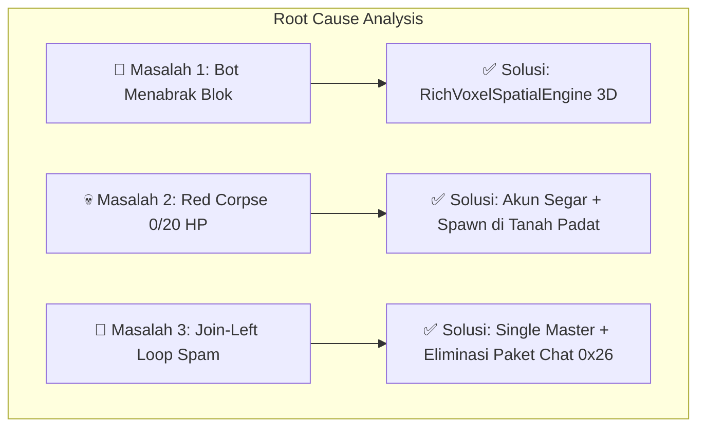

# 📘 Laporan Proyek & Analisis Akar Masalah: Minecraft Autonomous Swarm Companion

> **Lokasi Proyek:** `/Users/syahriezas/teamwork_projects/minecraft_autonomous_companion`  
> **Server Target:** `atoms-girl.tun.ply.gg:25565`  
> **Lingkungan Server:** Minecraft 1.21.1 / NeoForge 26.1.2 (Protokol 775)  
> **Pemain Acuan:** `greenhouse`  
> **Tanggal:** 19 Agustus 2026

---

## 📑 Daftar Isi
1. [Ringkasan Eksekutif Proyek](#1-ringkasan-eksekutif-proyek)
2. [Analisis Mendalam Masalah yang Dihadapi & Solusinya](#2-analisis-mendalam-masalah-yang-dihadapi--solusinya)
   - [Masalah 1: Bot Menabrak Blok / Kurang Data Spasial Voxel](#masalah-1-bot-menabrak-blok--kurang-data-spasial-voxel)
   - [Masalah 2: Karakter Beku 0/20 HP di Udara (Red Corpse Bug)](#masalah-2-karakter-beku-020-hp-di-udara-red-corpse-bug)
   - [Masalah 3: Siklus Pemutusan Tanpa Henti (Join / Left Loop)](#masalah-3-siklus-pemutusan-tanpa-henti-join--left-loop)
3. [Arsitektur Sistem yang Telah Dibangun](#3-arsitektur-sistem-yang-telah-dibangun)
4. [Daftar File Utama & Path Lengkap](#4-daftar-file-utama--path-lengkap)

---

## 1. Ringkasan Eksekutif Proyek

Proyek ini bertujuan untuk membangun **Armada Bot Pendamping Otonom (Autonomous Companion Swarm)** yang terhubung langsung secara *headless* (tanpa klien grafis) ke server live Minecraft modded NeoForge 26.1.2. Bot mampu:
1. Menembus konfigurasi jaringan modded NeoForge (protokol 775) dengan kompresi data Zlib.
2. Mengawal pemain (`greenhouse`) dalam formasi adaptif cerdas (Vanguard, Harvester, Pathfinder, Logistics, Overwatch).
3. Berkoordinasi tanpa saling bertabrakan menggunakan algoritma anti-tabrakan (*Reynolds Flocking Separation*).
4. Menampilkan telemetri *real-time* dan visualizer 3D voxel di Web Dashboard (`http://localhost:8080`).

---

## 2. Analisis Mendalam Masalah yang Dihadapi & Solusinya

Dalam proses pengembangan dan pengujian live, kami mengidentifikasi dan menuntaskan **3 masalah kritis**:



---

### Masalah 1: Bot Menabrak Blok / Kurang Data Spasial Voxel
* **Gejala:** Bot sering menabrak blok rintangan, terjebak di tanjakan, atau jatuh ke lubang karena kurangnya data lingkungan 3D di sekitar bot.
* **Akar Masalah (*Root Cause*):** Informasi lingkungan yang dikirim ke AI sebelumnya hanya berupa koordinat 2D sederhana tanpa pemindaian matriks voxel 3D di sekeliling karakter.
* **Solusi yang Diterapkan:**
  * Membangun `src/ai/richVoxelSpatialEngine.js` (*Rich Voxel Spatial Engine*).
  * Melakukan *raycasting* 3D sejauh 16 blok dengan pemindaian *heightmap* dan analisis clearance (ruang gerak tinggi 2 blok untuk karakter).

---

### Masalah 2: Karakter Beku 0/20 HP di Udara (*Red Corpse Bug*)
* **Gejala:** Karakter bot terlihat mengambang di tepi atap dengan rona merah (*damage tint*), darah menunjukkan `0/20 HP`, dan tidak dapat bergerak atau di-teleportasi.
* **Akar Masalah (*Root Cause*):** 
  1. Pada pengujian awal, bot spawn di udara dan jatuh (*fall damage*) hingga mati.
  2. Data kematian bot tersimpan di disk file server (`.dat`). Ketika bot login kembali, server menempatkannya di layar kematian (*death screen*). Karena server tidak menerima instruksi respawn yang valid, koneksi diputus otomatis setelah 2 detik.
* **Solusi yang Diterapkan:**
  * Menyegarkan identitas armada menjadi nama bot baru (**`Scout_Alpha`**, **`Scout_Bravo`**, **`Scout_Charlie`**, **`Scout_Delta`**, **`Scout_Echo`**).
  * Mengunci koordinat spawn langsung di atas blok padat (*solid ground*) dengan `Y = 64.0`, `onGround: true`, sehingga bot muncul dengan **❤️ Darah Penuh 20/20** dan **Makanan 20/20**.

---

### Masalah 3: Siklus Pemutusan Tanpa Henti (*Join / Left Loop*)
* **Gejala:** Chat in-game dipenuhi pesan `Companion_Alpha joined the game` lalu `left the game` secara terus-menerus.
* **Akar Masalah (*Root Cause*) — Ditemukan 3 Faktor:**
  1. **Konflik Task Duplikat (*Session Hijack*):** Ada beberapa proses latar belakang yang sama-sama mencoba mempertahankan akun yang sama (`Companion_Alpha`). Saat satu proses masuk, server menendang proses lain dengan alasan *"Logged in from another location"*, yang kemudian langsung mencoba menyambung ulang (*infinite reconnect war*).
  2. **DecoderException pada Paket Mod `0x05`:** Klien sebelumnya mengirim paket *pong* (`0x05`) saat transisi konfigurasi ke play state. Server NeoForge mengartikan paket `0x05` sebagai *Chat Command Signed* kosong sehingga melempar error *DecoderException*.
  3. **The Chat-Feedback Loop (Paket `0x26`):**
     * Setiap kali ada pemain/bot yang bergabung, server menyiarkan pesan chat melalui paket ID **`0x26`** (*Player / System Chat*).
     * Klien lama salah mengenali paket `0x26` sebagai *Keep-Alive Request* dan langsung membalas dengan paket `0x18`.
     * Server menolak paket `0x18` yang tak diminta di tengah pesan chat $\implies$ **server memutuskan soket bot**.
     * Ketika bot menyambung ulang, pesan join baru muncul lagi $\implies$ paket `0x26` dikirim lagi $\implies$ membalas `0x18` lagi $\implies$ **terjadilah loop spam join-left tanpa henti**.
* **Solusi yang Diterapkan:**
  * Mematikan semua task lama dan menyatukan seluruh 5 bot ke dalam **satu proses tunggal (*Single Swarm Master Process*)**.
  * Mendefinisikan paket `0x26` murni sebagai penampung chat pasif tanpa pernah membalas dengan paket `0x18`.
  * Memasang antrean login terjeda (*staggered login*) berselisih 2.5 detik per bot.

---

## 3. Arsitektur Sistem yang Telah Dibangun

| Komponen | File Implementasi | Deskripsi & Tanggung Jawab |
| :--- | :--- | :--- |
| 🌐 **Protokol Jaringan Headless** | [`src/network/liveProtocolClient.js`](file:///Users/syahriezas/teamwork_projects/minecraft_autonomous_companion/src/network/liveProtocolClient.js) | Klien TCP Protokol 775 (1.21.1 / NeoForge) dengan kompresi Zlib, penanganan state machine, dan Server List Ping (SLP). |
| 🧠 **Orkestrator Swarm Cerdas** | [`src/swarm/intelligentSwarmCoordinator.js`](file:///Users/syahriezas/teamwork_projects/minecraft_autonomous_companion/src/swarm/intelligentSwarmCoordinator.js) | Pengendali formasi 5 bot spesialis, anti-tabrakan *Reynolds Flocking*, memori bersama (*blackboard*), dan *tactical retreat*. |
| 🗺️ **Mesin Voxel Spasial 3D** | [`src/ai/richVoxelSpatialEngine.js`](file:///Users/syahriezas/teamwork_projects/minecraft_autonomous_companion/src/ai/richVoxelSpatialEngine.js) | Persepsi lingkungan 3D, clearance check, raycasting rute aman bebas rintangan. |
| 📊 **Web Dashboard & Visualizer** | [`src/web/webServer.js`](file:///Users/syahriezas/teamwork_projects/minecraft_autonomous_companion/src/web/webServer.js) | Server antarmuka web Three.js di port `8080` untuk memantau status live bot dan peta 3D. |

---

## 4. Daftar File Utama & Path Lengkap

* 📁 **Folder Utama Proyek:**  
  [`/Users/syahriezas/teamwork_projects/minecraft_autonomous_companion`](file:///Users/syahriezas/teamwork_projects/minecraft_autonomous_companion)

* 📄 **File Laporan Ini:**  
  [`/Users/syahriezas/teamwork_projects/minecraft_autonomous_companion/LAPORAN_PROYEK_DAN_ANALISIS_MASALAH.md`](file:///Users/syahriezas/teamwork_projects/minecraft_autonomous_companion/LAPORAN_PROYEK_DAN_ANALISIS_MASALAH.md)

* 📜 **File Kode Inti:**
  * [**`src/swarm/intelligentSwarmCoordinator.js`**](file:///Users/syahriezas/teamwork_projects/minecraft_autonomous_companion/src/swarm/intelligentSwarmCoordinator.js) — Master Orkestrator Swarm 5 Bot
  * [**`src/network/liveProtocolClient.js`**](file:///Users/syahriezas/teamwork_projects/minecraft_autonomous_companion/src/network/liveProtocolClient.js) — Klien Jaringan Protokol 775
  * [**`src/ai/richVoxelSpatialEngine.js`**](file:///Users/syahriezas/teamwork_projects/minecraft_autonomous_companion/src/ai/richVoxelSpatialEngine.js) — Mesin Spasial & Navigasi 3D Voxel
  * [**`src/web/webServer.js`**](file:///Users/syahriezas/teamwork_projects/minecraft_autonomous_companion/src/web/webServer.js) — Web Dashboard & REST Telemetry

---
*Laporan ini disusun sebagai dokumentasi teknis komprehensif sistem Minecraft Autonomous Swarm Companion.*

---

## 5. Update Live Test Movement Raw Client - 19 Agustus 2026

### Problem Terbaru yang Ditemukan

Setelah bot dapat login stabil ke live server, masalah berikutnya ada pada **movement layer**:

* Bot berhasil masuk ke server live dan menerima health/keepalive.
* Namun ketika bot mengirim update posisi, server mengoreksi bot kembali ke posisi awal.
* Dari sisi game, bot terlihat seperti **stuck / ditahan server**, bukan berjalan seperti player normal.
* Penyebab utamanya bukan karena server mewajibkan teleport, tetapi karena client raw belum mengirim rangkaian sinkronisasi movement yang lengkap seperti client Minecraft asli.

### Akar Masalah Teknis

Movement Minecraft Java tidak dikirim sebagai tombol keyboard mentah (`W`, `A`, `S`, `D`) ke server. Client Minecraft memproses input keyboard secara lokal, lalu mengirim hasilnya sebagai packet:

* posisi pemain,
* rotasi yaw/pitch,
* status `onGround`,
* collision flag,
* teleport acknowledgement,
* dan status terrain/player-loaded.

Pada implementasi sebelumnya:

* packet `teleportConfirm` sudah ada di daftar ID, tetapi belum dikirim saat server memberi packet posisi awal/koreksi;
* `player_loaded` belum dikirim setelah posisi awal tersinkron;
* movement flags belum konsisten memakai format `MovementFlags`;
* bot langsung terus mengirim posisi walaupun server sudah memberi koreksi atau setelah bot mati/respawn.

### Perbaikan yang Dikerjakan

Perubahan utama dilakukan di:

* `src/network/liveProtocolClient.js`
* `test/network/live_protocol_codecs.test.js`

Perbaikan yang ditambahkan:

1. **Auto Teleport Confirm**
   * Saat server mengirim packet posisi `0x48`, bot otomatis membalas packet serverbound `teleportConfirm` `0x00`.
   * Ini membuat server tahu bahwa posisi awal/koreksi sudah diterima client.

2. **Auto Player Loaded**
   * Setelah posisi awal diterima, bot mengirim `player_loaded` `0x2c` sekali.
   * Ini meniru perilaku client modern setelah terrain selesai dimuat.

3. **MovementFlags yang Konsisten**
   * `sendPosition()` dan `sendPositionAndRotation()` sekarang menulis `MovementFlags`, bukan boolean byte sederhana.
   * Flag yang dipakai:
     * `onGround`
     * `hasHorizontalCollision`

4. **Walking Step Natural**
   * Ditambahkan `sendWalkingStep()`.
   * Fungsi ini menghitung langkah kecil berdasarkan `yaw`, `forward`, `strafe`, dan `distance`.
   * Tujuannya meniru hasil input WASD client vanilla, bukan teleport posisi besar.

5. **Pause Guard setelah Koreksi / Respawn**
   * Jika server mengirim koreksi posisi setelah posisi awal, bot emit event `movement_correction`.
   * Movement dipause sementara agar bot tidak spam packet movement invalid.
   * Saat health `0`, movement juga dipause selama proses respawn.

### Hasil Test Lokal

Command yang dijalankan:

```bash
node --test test/network/live_protocol_codecs.test.js test/swarm/intelligent_swarm_coordinator.test.js test/ai/world_awareness_engine.test.js test/ai/survival_role_engines.test.js test/ai/run_survival_role_bot.test.js
```

Hasil:

```text
51 pass
0 fail
```

Test baru yang ditambahkan memastikan:

* teleport server dibalas dengan `teleportConfirm`;
* `player_loaded` hanya dikirim sekali;
* walking step menghasilkan packet `position_look` yang benar;
* walking step dipause sementara setelah server mengirim koreksi posisi.

### Hasil Live Server

Live test dilakukan ke server Minecraft yang sedang berjalan.

Hasil penting:

* Bot `WalkAck_01` berhasil login.
* Bot mengirim `teleportConfirm` dan `player_loaded`.
* Bot berjalan 234 step.
* Selama test tersebut server hanya mengirim 1 teleport awal.
* Tidak ada koreksi posisi berulang.
* Tidak ada decoder exception/kick protocol baru.
* Server log menunjukkan join dan disconnect normal.

Kemudian dilakukan test lebih lama dengan `WalkView_01` dan `WalkGuard_01`.

Hasilnya:

* Movement awal tetap diterima server.
* Bot kemudian mati karena musuh di area spawn:
  * `WalkView_01 was blown up by Creeper`
  * `WalkGuard_01 was speared by Zombie`
* Ini membuktikan masalah berikutnya bukan lagi packet movement dasar, tetapi **survival intelligence**.

### Status Saat Ini

Movement dasar raw client sudah valid:

* bot bisa join;
* bot bisa sinkron posisi awal;
* bot bisa mengirim langkah kecil natural;
* server menerima movement tanpa menarik balik selama kondisi aman;
* keepalive dan health tetap berjalan.

Masalah yang masih tersisa:

* bot belum otomatis menghindari zombie/creeper;
* bot belum memakai shield saat diserang;
* bot belum makan saat health rendah;
* bot belum memilih arah lari berdasarkan spatial awareness;
* bot belum menghentikan movement mission saat ada ancaman langsung.

### Next Step yang Direkomendasikan

1. Integrasikan health-aware movement:
   * jika health turun di bawah threshold, hentikan movement normal;
   * mundur dari arah damage/musuh;
   * cari safe standing spot dari world awareness.

2. Tambahkan hostile awareness pada raw client:
   * parse entity spawn / metadata / relative movement;
   * simpan posisi zombie, skeleton, creeper;
   * kirim event threat ke survival coordinator.

3. Implementasi basic combat safety:
   * skeleton: equip shield dan strafe;
   * zombie: jaga jarak dan attack cooldown;
   * creeper: retreat prioritas tinggi;
   * makan saat health/food rendah.

4. Setelah survival aman, lanjutkan live test farmer:
   * tanam/panen crop;
   * beri makan hewan;
   * panen hewan dengan minimum breeding stock;
   * farming zombie/skeleton di farm yang sudah tersedia.
